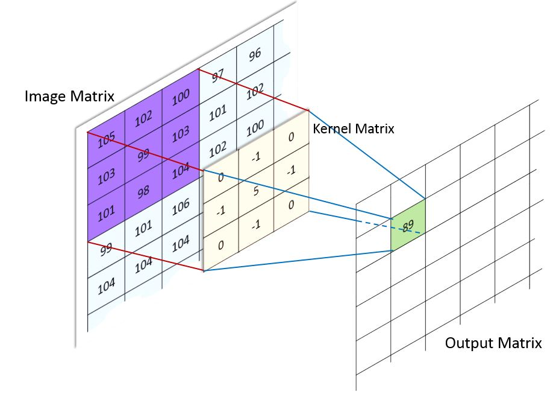
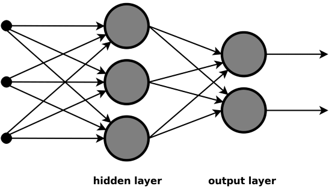

202237752 고정수 인공지능개론 레포트 과제

# 5월 1일 배운 내용 정리

## 1. Dense의 이미지 데이터 처리 문제

### 용어 정리

| 용어                    | 의미                                                  |
| ----------------------- | ----------------------------------------------------- |
| Flatten, 평탄화         | 2차원/3차원 이미지를 1차원 벡터로 펴는 작업           |
| Dense Layer             | 이전 층의 모든 값과 다음 층의 모든 유닛을 연결하는 층 |
| Fully Connected Network | Dense Layer 중심으로 구성된 신경망                    |

- Dense Layer

  Dense Layer는 **하나의 큰 가중치 행렬과 하나의 바이어스 벡터**로 표현된다.
  - 모든 입력 유닛과 출력 유닛이 연결되기 때문이다. 그러나, 하나의 행렬, 벡터로 나올 뿐, 매개변수의 수는 많아질 수 있다.

- CNN의 Conv Layer

  Conv Layer는 **다수의 작은 가중치 행렬과 다수의 바이어스 벡터**로 표현된다.
  - 그 이유는 여러 개의 필터를 가지기 때문이다. 필터를 n개 사용하면, n개의 매개변수 묶음이 나온다.

  | 구분        | Dense Layer                | CNN Conv Layer                       |
  | ----------- | -------------------------- | ------------------------------------ |
  | 연결 방식   | 모든 입력과 모든 출력 연결 | 작은 지역 영역만 연결                |
  | 가중치 구조 | 큰 행렬 하나로 표현        | 여러 개의 필터/커널                  |
  | 공간 정보   | Flatten하면 약해짐         | 공간 구조 유지                       |
  | 파라미터 수 | 입력 크기에 크게 의존      | 필터 크기, 채널 수, 필터 개수에 의존 |
  | 특징        | 전체를 한 번에 봄          | 작은 패턴을 훑으면서 찾음            |

  ***

### 왜 Dense는 이미지 처리할 때 문제가 되는가?

예를 들어, 흑백 이미지(글로 쓴 숫자)가 `28 × 28`으로 이루어진 2차원 픽셀 배열이라고 하면, 이를 Flatten하게 되면, `1×784`라는 벡터가 된다.

> `28행 × 28열 이미지` → `784개의 숫자가 일렬로 나열된 벡터` 가 되버린다.<br>이때, 이미지의 **위/아래/왼쪽/오른쪽 위치 관계**가 약해진다.

원래 이미지에서는 어떤 픽셀들이 서로 가까웠는데, Flatten 후에는 그냥 “784개 숫자 중 몇 번째 값”이 된다.
즉, **공간적 구조를 직접 활용하기 어려워진다.**

다시 정리하면, **이미지를 Flatten(평탄화)하여 Dense/Fully Connected Layer에 입력하면, <u>픽셀 간의 위치 관계와 같은 공간적 구조를 충분히 활용하기 어렵다</u>**

그래서 나온게 CNN이다.

---

## 2. CNN

그러면, 이미지는 DL으로 어떻게 처리해야 할까? 바로 **CNN**이다.

CNN은 이미지 문제를 어떻게 해결했을까?

→ 바로 **Convolution 연산**을 이용하기 때문이다.

### Convolution 연산이란?

이미지에서의 컨벌루션 연산은 정리하면, **필터를 입력 이미지 위에서 이동시키며, 각 위치의 지역적 특징을 계산하여 Feature Map을 만드는 연산**이다.

쉽게 말하면:

> 작은 필터를 이미지 위에서 움직이면서, <br>각 위치마다 “이 패턴이 얼마나 강하게 있는지” 계산하는 연산

이다.

예를 들어 필터가 `3 × 3`이면 이미지의 `3 × 3` 영역과 필터를 겹친다.

```
이미지 일부        필터
[1 2 0]         [1 0 -1]
[0 1 3]    ×    [1 0 -1]
[2 1 0]         [1 0 -1]
```

그러고서, 각 자리끼리 곱하고 전부 더한다.

```
1×1 + 2×0 + 0×(-1)
+ 0×1 + 1×0 + 3×(-1)
+ 2×1 + 1×0 + 0×(-1)
```

이렇게 하면, 숫자 하나가 나온다. 그다음 필터를 옆으로 한 칸 이동해서 또 계산하는 것을 반복한다. 그러면 **결과적으로 새로운 2차원 배열이 나온다.**<br>
이 새로운 2차원 배열을 **특징맵(Feature Map)**이라고 한다.

---

### 용어 정리

| 용어          | 의미                                                       |
| ------------- | ---------------------------------------------------------- |
| Kernel        | 작은 가중치 행렬. 보통 `3 × 3`, `5 × 5` 같은 것            |
| Filter        | 입력 채널 전체에 적용되어 특징맵 하나를 만드는 가중치 묶음 |
| Mask          | 전통적인 영상처리에서 쓰는 고정된 필터/커널을 부르는 말    |
| Weight Kernel | 학습되는 커널 가중치                                       |

그냥 용어는

> 커널 ≒ 필터 ≒ 마스크

라고 생각하면 편하다.

---

### 특징맵(feature map)이란?

특징맵은 필터가 이미지를 훑으면서 만든 결과다.
쉽게 말하면:

> 어떤 특징이 이미지의 어느 위치에 강하게 나타나는지 표시한 지도

이다.

예를 들면, 교재의 p.363 의 라플라시안 필터는 사진의 에지(사물의 경계선)라는 특징을 추출한다.
이는 다음과 같은 특징을 가진 특징맵을 만들어낸다.

```
사물의 경계선(에지)가 있는 위치 → 큰 값
사물의 경계선(에지)가 없는 위치 → 작은 값
```

그래서, CNN의 첫 층에서는 에지와 같은 단순한 특징을 잡는다.

```
엣지, 선, 모서리, 밝기 변화
```

그리고, 더 깊은 층으로 갈수록 복잡한 특징을 잡는다.

```
눈, 코, 바퀴, 귀, 얼굴 윤곽, 물체 일부
```

최종적으로 마지막에는 전체 물체를 판단한다.(이러한 판단은 마지막에 Flatten을 하여 결국 Dense(Full Connected Network)를 거쳐 Classification을 한다.)

```
고양이 / 강아지 / 자동차 / 사람
```

---

### 필터와 특징맵의 관계

**필터 하나는 하나의 Feature Map을 만든다.** 따라서 **필터 개수가 많아질수록 출력 Feature Map의 개수도 증가**한다.

교재에는 커널이 많아지면 자연스럽게 특징맵의 개수도 많아진다고 되어있다.

어찌됐든, 여기서 중요한 것은

```
필터:특징맵 = 1:1
```

이라는 사실이다.

그래서, 필터(커널)이 많아질 수록 특징맵도 많아진다.

---

### 전통적인 영상처리의 필터와 CNN의 필터의 차이

전통적인 영상처리에서는 사람이 직접 필터를 정했다. 하지만, CNN에서는 필터값을 사람이 직접 정하지 않는다.

CNN에서의 필터값은

> **초기에는 랜덤값** → **학습하면서 최적화**

방식으로 정해진다.

즉, CNN에서 **필터는 사람이 직접 정하는 것이 아니라 학습을 통해 최적화**된다.

---

### Stride와 Padding

- Stride란

  필터의 이동 간격을 의미한다.
  예를 들면,
  - `stride = 1`: 1 픽셀씩 이동한다.
  - `stride = 2`: 2 픽셀씩 이동한다.

  즉, stride가 커질수록 이미지를 덜 촘촘하게 본다. 그래서, 출력 특징맵의 크기가 작아진다.

  stride가 커질수록 다음과 같은 특징을 가진다.
  - 출력 크기 감소
  - 계산량 감소
  - 정보는 더 거칠게 요약

- Padding이란

  **경계처리(가장자리)의 처리 여부**를 뜻한다.

  필터는 입력 이미지를 넘어갈 수 없기 때문에, 가장자리는 특징맵을 만들지 못하게 된다.

  이때, 가장자리를 처리하고 싶을 때는, 가장자리에 값을 덧붙여서 처리한다.

  예를 들어 0을 넣어 처리한다고 하면,

  ```
  0 0 0 0 0
  0 이미지 0
  0 이미지 0
  0 이미지 0
  0 0 0 0 0
  ```

  와 같이 처리된다.

  교재에는 2가지 표현이 나온다.
  1.  Valid Padding: 가장자리를 처리하지 않는다. 그래서, 출력이 감소한다.
  2.  Same Padding: 출력 크기를 입력과 비슷하게 유지하도록 값을 추가한다. 위처럼 0으로 채우는 것을 zero-padding이라고 한다.

  패딩을 하여 가장자리에 값을 넣는 이유는 주로 두가지이다.
  1.  출력 크기가 너무 작아지는 것을 막기 위해
  2.  이미지 가장자리 정보도 충분히 반영하기 위해

  https://modulabs.co.kr/blog/padding-cnn-basic

  ▲ 이 사이트를 들어가면 이해가 쉽다.

### 풀링(Pooling)이란?

풀링은 서브 샘플링이라고 하는 것으로 **특징맵의 데이터 크기를 줄이면서 요약하는 연산**이다.

풀링도 컨벌루션처럼 **윈도우(영역)를 움직여서 영역 안에 있는 숫자를 하나의 숫자로 요약**한다.

교재에 나와있듯이 대표적으로 두가지가 있다.

1. Max Pooling: 영역 안에서 가장 큰 값만 뽑음

   예를 들어, 아래의 4×4 이미지를

   ```
   [12  20  30   0]
   [8   12   2   0]
   [34  70  37   4]
   [112 100  2  12]
   ```

   2×2 크기의 윈도우로 Max Pooling 한다면,

   ```
   [12 20]       | [30 0]       | [ 34  70]        | [37  4]
   [8  12] -> 20 | [ 2 0] -> 30 | [112 100] -> 112 | [ 2 12] -> 37
   ```

   가 되어 최종적으로

   ```
   [ 20 30]
   [112 37]
   ```

   이 된다.

2. Average Pooling: 영역 안의 평균값을 뽑음

   예를 들어, 아래의 4×4 이미지를

   ```
   [12  20  30   0]
   [8   12   2   0]
   [34  70  37   4]
   [112 100  2  12]
   ```

   2×2 크기의 윈도우로 Max Pooling 한다면,

   ```
   [12 20]       | [30 0]      | [ 34  70]       | [37  4]
   [8  12] -> 13 | [ 2 0] -> 8 | [112 100] -> 79 | [ 2 12] -> 20
   ```

   가 되어 최종적으로

   ```
   [13  8]
   [79 20]
   ```

   이 된다.

   ***

Pooling의 역할은 다음과 같다.

- 중요한 정보를 요약
- 이동에 대한 불변(둔감)

---

# CNN, RNN, LSTM 레포트

## 1. 서론

딥러닝에서는 **데이터의 종류에 따라 중요한 특징이 다르기 때문에, 그에 맞는 신경망 구조를 사용하는 것이 중요하다.**

일반적인 테이블 데이터는 각 열이 하나의 특징(feature)으로 사용되며, 주로 특징들 사이의 관계를 학습하는 것이 중요하다. 예를 들어 나이, 키, 공부 시간, 출석률과 같은 데이터는 각각의 값이 결과에 어떤 영향을 주는지를 학습하는 방식으로 처리할 수 있다.

하지만 **이미지 데이터나 순차 데이터는 일반적인 테이블 데이터와 다른 구조적 특징을 가진다.**

이미지 데이터는 단순히 픽셀 값만 중요한 것이 아니라, **픽셀들이 어떤 위치 관계를 이루고 있는지가 중요하다.** 예를 들어 고양이 사진을 분류할 때는 눈, 귀, 코와 같은 부분들이 이미지 안에서 어떤 공간적 관계를 가지는지가 중요한 정보가 된다. 따라서 **이미지를 단순히 1차원 벡터로 평탄화하여 완전 연결 신경망에 입력하면 이러한 <u>공간적 특징</u>을 충분히 반영하기 어렵다.**

반면 **문장이나 시계열 데이터와 같은 순차 데이터는 데이터가 등장하는 순서가 중요하다.** 문장에서는 단어의 순서에 따라 의미가 달라지고, 시계열 데이터에서는 이전 시점의 값이 이후 시점의 값에 영향을 줄 수 있다. 따라서 **순차 데이터는 각각의 값을 <u>독립적으로 보기보다, 앞뒤 흐름과 이전 정보를 함께 고려</u>해야 한다.**

이러한 데이터의 구조적 특징을 반영하기 위해 다양한 신경망 구조가 사용된다. **CNN은 이미지 데이터의 공간적 특징을 추출**하기 위해 사용되고, **RNN은 순서가 있는 데이터를 처리**하기 위해 사용된다. 또한 **LSTM은 RNN이 <u>긴 순서 데이터</u>에서 오래전 정보를 잘 기억하지 못하는 장기 의존성 문제를 보완**하기 위해 사용된다.

따라서 본 레포트에서는 CNN, RNN, LSTM의 기본 개념과 구조를 정리하고, 각 모델이 어떤 데이터의 특징을 처리하기 위해 설계되었는지 이해하는 것을 목적으로 한다.

---

## 2. CNN

### 2.1 Fully Connected Network와 CNN의 차이

기존에 학습한 일반적인 신경망은 주로 Fully Connected Network 구조를 가진다. Fully Connected Network에서는 하위 레이어의 모든 유닛이 상위 레이어의 모든 유닛과 연결된다. 이러한 층을 Dense Layer 또는 Fully Connected Layer라고 부른다. 즉, Dense Layer는 입력으로 들어온 모든 값을 하나의 벡터로 보고, 각 입력 유닛을 다음 층의 모든 출력 유닛과 연결하여 계산을 수행한다.

예를 들어 이미지 데이터를 Fully Connected Network에 입력하려면, 2차원 또는 3차원 형태의 이미지를 먼저 1차원 벡터로 평탄화해야 한다. 이를 Flatten이라고 한다. 흑백 이미지가 `28 × 28` 크기라면, 이를 `784`개의 값을 가진 1차원 벡터로 변환한 뒤 Dense Layer에 입력한다.

하지만 이미지를 평탄화하면 픽셀들이 원래 가지고 있던 **공간적 위치 관계를 충분히 활용하기 어렵다.** 이미지에서는 단순히 픽셀 값 자체뿐만 아니라, **어떤 픽셀이 어떤 픽셀과 가까이 있는지, 선이나 모서리 같은 패턴이 어느 위치에 나타나는지**가 중요하다. 그런데 Flatten을 수행하면 이러한 2차원적인 구조가 1차원으로 펼쳐지기 때문에, **이미지의 공간적인 특징이 약해질 수 있다.**

또한 Fully Connected Network는 모든 입력 유닛과 출력 유닛이 연결되기 때문에 이미지의 크기가 커질수록 필요한 가중치의 수가 크게 증가한다. 예를 들어 입력 이미지의 픽셀 수가 많고 출력 유닛 수도 많다면, 그에 따라 학습해야 할 매개변수의 수가 많아진다. 매개변수가 많아지면 학습 속도가 느려질 수 있고, 학습 데이터에 과도하게 맞춰지는 overfitting 문제가 발생할 가능성도 높아진다.

반면 CNN은 이미지를 무조건 1차원으로 펼쳐서 처리하지 않고, 이미지의 **공간 구조를 유지한 상태에서 특징을 추출**한다. CNN은 작은 필터를 이미지 위에서 이동시키며 지역적인 영역을 확인하고, 그 영역에서 선, 모서리, 질감과 같은 특징을 찾아낸다. 이때 필터는 이미지 전체를 한 번에 보는 것이 아니라 작은 영역을 반복적으로 훑으면서 특징맵을 생성한다.

따라서 Fully Connected Network가 입력 전체를 하나의 벡터로 보고 모든 유닛을 연결하는 방식이라면, CNN은 이미지의 위치 관계를 유지하면서 작은 필터를 통해 지역적 특징을 추출하는 방식이다. 이러한 구조 덕분에 CNN은 이미지 분류, 객체 인식, 의료 영상 분석처럼 공간적 특징이 중요한 문제에서 효과적으로 사용된다.

### 2.2 Convolution 연산의 개념과 목적

CNN의 핵심 연산은 Convolution, 즉 합성곱 연산이다. 합성곱 연산은 입력 이미지의 작은 영역에 필터를 적용하여 새로운 특징을 추출하는 연산이다. 여기서 필터는 이미지에서 특정한 패턴을 찾아내기 위한 작은 가중치 행렬이다. 예를 들어 어떤 필터는 세로선과 같은 특징을 잘 감지할 수 있고, 다른 필터는 가로선, 모서리, 질감과 같은 특징을 감지할 수 있다.

합성곱 연산은 필터를 이미지 위에서 일정한 간격으로 이동시키면서 이루어진다. 필터가 이미지의 한 영역과 겹치면, 해당 영역의 픽셀 값과 필터의 가중치를 각각 곱한 뒤 모두 더한다. 이렇게 계산된 하나의 값은 출력 특징맵의 한 위치에 저장된다. 이후 필터를 옆이나 아래로 이동시키며 같은 계산을 반복하면, 입력 이미지로부터 새로운 2차원 배열이 만들어진다. 이 결과를 Feature Map, 즉 특징맵이라고 한다.



출처:http://machinelearninguru.com/computer_vision/basics/convolution/image_convolution_1.html

출처: https://kionkim.github.io/2018/06/08/Convolution_arithmetic/

필터, 커널, 마스크는 문맥에 따라 비슷한 의미로 사용된다. 일반적으로 커널은 작은 가중치 행렬 자체를 의미하고, 필터는 입력 데이터에 적용되어 하나의 특징맵을 만들어내는 가중치 묶음을 의미한다. 마스크는 전통적인 영상처리에서 특정 효과나 특징을 추출하기 위해 사용하던 고정된 필터를 가리키는 경우가 많다. CNN에서는 이러한 필터의 값이 사람이 직접 정한 값이 아니라, 학습을 통해 최적화되는 가중치라는 점이 중요하다.

> **필터의 가중치는 어떻게 결정될까?**
>
> 이를 알기 위해서는 먼저 어떻게 필터 안의 값이 변하는지 알아야 한다.
>
> 1. 초기값은 랜덤하게 둔다!
>
> 그 이유는 다음과 같다.
>
> - 처음에는 어떤 필터가 좋은지 알 수 없기 때문
> - 모든 필터를 0이나 같은 값으로 초기화하면 똑같은 필터가 되어버리기 때문에 필터들이 서로 다른 특징을 학습하게 하기 위해서
> - 완전한 랜덤은 아니고, Xavier 초기화, He 초기화 방식을 사용하여 너무 크거나 작지 않게 초기화한다.
>
> 2.  Forward Propagation
>
> 현재 필터 가중치로 이미지를 훑으면서 feature map을 만든다.
>
> ```
> 입력 이미지 → Conv 필터 적용 → feature map → activation → 다음 layer → 예측값
> ```
>
> 위와 같은 흐름으로 예측값을 구한다.
>
> 3.  Loss Function으로 오차 계산
>
> 예측값과 실제 정답을 비교해서 loss를 구한다.
>
> 4.  Backward propagation으로 각 필터 가중치의 책임 계산
>
> 필터 내에 있는 여러 가중치의 책임을 계산한다.
>
> 5.  Optimizer가 필터 가중치를 업데이트
>
> 경사하강법을 통해 다음 가중치를 구한다.

합성곱 연산의 목적은 이미지에서 선, 모서리, 질감, 형태와 같은 지역적 특징을 추출하는 것이다. 이미지는 전체 픽셀을 한 번에 보는 것보다, 가까운 픽셀들이 이루는 작은 패턴을 먼저 파악하는 것이 중요하다. CNN은 필터를 이용해 이미지의 작은 영역을 반복적으로 확인하면서 이러한 지역적 특징을 찾아내고, 여러 필터를 사용하여 다양한 특징맵을 생성한다.

따라서 합성곱 연산은 이미지의 공간적 구조를 유지하면서 중요한 특징을 추출하기 위한 연산이라고 할 수 있다. CNN은 이 과정을 여러 층에서 반복하며, 초기 층에서는 선이나 모서리와 같은 단순한 특징을 추출하고, 깊은 층으로 갈수록 물체의 일부나 전체 형태와 같은 복잡한 특징을 학습한다.

---

### 2.3 Filter, Kernel, Feature Map

CNN에서 Filter는 이미지에서 특정한 특징을 찾아내기 위해 사용되는 작은 가중치 묶음이다. 일반적으로 필터는 입력 이미지의 작은 영역(교재에서는 윈도우라고도 한다.)에 적용되며, 해당 영역의 픽셀 값과 필터 내부의 가중치를 곱하고 더해 새로운 값을 만든다. 이 과정을 이미지 전체에 반복하면 하나의 Feature Map이 생성된다.

Kernel은 보통 필터 내부의 작은 가중치 행렬을 의미한다. 예를 들어 `3 × 3` 크기의 커널은 9개의 가중치를 가지며, 입력 이미지의 `3 × 3` 영역과 대응되어 계산된다. 문맥에 따라 Filter와 Kernel은 거의 같은 의미로 사용되기도 하지만, 엄밀히 말하면 Kernel은 작은 가중치 행렬 자체를 의미하고, Filter는 입력 채널 전체에 적용되어 하나의 Feature Map을 만들어내는 가중치 묶음이라고 볼 수 있다.

Feature Map은 필터를 입력 이미지에 적용한 결과로 만들어지는 출력이다. 하나의 필터는 이미지에서 특정한 패턴이 어느 위치에 강하게 나타나는지를 나타내는 하나의 Feature Map을 만든다. 예를 들어 어떤 필터가 세로선에 민감하게 학습되었다면, 그 필터가 만든 Feature Map에서는 세로선이 있는 위치의 값이 크게 나타날 수 있다.

CNN에서는 필터의 개수와 출력 feature map의 개수가 직접적으로 연결된다. 필터 하나는 하나의 Feature Map을 만들기 때문에, 필터를 16개 사용하면 출력 feature map도 16개가 생성된다. 따라서 Conv Layer의 출력 채널 수는 사용한 필터의 개수와 같다.

예를 들어 (교재 p.368) 입력 이미지의 크기가 `6 × 6 × 3`이고, `3 × 3 × 3` 필터를 2개 사용한다고 하자. 이때 각 필터는 입력 이미지에 합성곱 연산을 수행하여 하나의 Feature Map을 만드므로, 총 2개의 `4 × 4` Feature Map이 생성된다. 따라서 출력은 공간 크기와 채널 수를 함께 고려하여 `4 × 4 × 2`과 같은 형태가 될 수 있다. 여기서 마지막 `2`은 필터의 개수, 즉 생성된 feature map의 개수를 의미한다. (필터와 특징맵의 개수는 거의 같다.)

따라서 CNN에서 필터와 Feature Map은 밀접한 관계를 가진다. 필터는 특정 특징을 감지하기 위한 학습 가능한 가중치이고, Feature Map은 그 필터가 입력 이미지에서 감지한 특징의 위치와 강도를 나타내는 결과라고 할 수 있다.

---

### 2.4 Stride와 Padding

CNN에서 합성곱 연산을 수행할 때 필터는 입력 이미지 위를 이동하면서 각 위치의 값을 계산한다. 이때 필터가 한 번에 얼마나 이동하는지를 Stride라고 한다. 즉, Stride는 필터가 이동하는 간격을 의미한다. Stride가 1이면 필터가 한 칸씩 이동하고, Stride가 2이면 두 칸씩 이동하면서 합성곱 연산을 수행한다.

Stride의 크기는 출력 feature map의 크기에 영향을 준다. Stride가 작으면 필터가 이미지를 촘촘하게 훑기 때문에 더 많은 위치에서 특징을 계산하게 되고, 출력 feature map의 크기도 상대적으로 커진다. 반대로 Stride가 커지면 필터가 더 큰 간격으로 이동하므로 계산되는 위치의 수가 줄어들고, 출력 feature map의 크기도 작아진다. 따라서 Stride는 출력 크기와 계산량을 조절하는 역할을 한다.

Padding은 입력 이미지의 가장자리에 값을 추가하는 것을 의미한다. 일반적으로는 입력 이미지의 바깥쪽에 0을 추가하는 Zero Padding을 많이 사용한다. 합성곱 연산을 할 때 필터는 입력 이미지의 내부 영역을 기준으로 이동하기 때문에, Padding을 사용하지 않으면 출력 feature map의 크기가 입력보다 작아진다. 또한 이미지의 가장자리 부분은 중앙 부분에 비해 필터가 적용되는 횟수가 적어질 수 있다.

Padding을 사용하면 이러한 문제를 완화할 수 있다. 입력 이미지의 가장자리에 0을 추가하면 필터가 가장자리 영역에도 더 잘 적용될 수 있고, 출력 feature map의 크기가 지나치게 줄어드는 것을 막을 수 있다. 특히 `same padding`을 사용하면 입력과 출력의 공간 크기를 같거나 비슷하게 유지할 수 있다. 반대로 Padding을 사용하지 않는 경우를 `valid padding`이라고 하며, 이 경우 출력 크기는 입력 크기보다 작아진다.

따라서 Stride와 Padding은 합성곱 연산에서 출력 feature map의 크기와 정보 보존 정도를 조절하는 중요한 요소이다. Stride는 필터가 이동하는 간격을 조절하여 출력 크기와 계산량에 영향을 주고, Padding은 입력의 가장자리 정보를 보존하고 출력 크기가 줄어드는 것을 조절하는 역할을 한다.

---

### 2.5 Pooling 계층

CNN에서 Pooling 계층은 Convolution 연산을 수행한 직후에 풀링층을 두는 경우가 많다. 풀링은 Convolution 연산을 통해 만들어진 **feature map의 크기를 줄이면서 요약**하는 계층(그래서 서브 샘플링이라고도 한다.)이다. Convolution Layer가 입력 이미지에서 선, 모서리, 질감과 같은 특징을 추출한다면, Pooling Layer는 추출된 특징을 요약하여 더 작은 크기의 Feature Map으로 변환한다.

Pooling은 보통 feature map의 작은 영역을 기준으로 수행된다. 예를 들어 `2 × 2` 크기의 영역에 Pooling을 적용하면, 그 영역 안의 값들을 하나의 값으로 요약한다. 이 과정을 Feature Map 전체에 반복하면 출력 feature map의 높이와 너비가 줄어든다.

Pooling 계층의 역할은 크게 세 가지이다.

첫째, feature map의 공간 크기를 줄여 정보량과 계산량을 감소시킨다. Convolution 연산을 여러 번 수행하면 많은 Feature Map이 생성되고, 그만큼 계산량도 증가할 수 있다. Pooling은 중요한 특징은 유지하면서 크기를 줄여 이후 계층의 연산 부담을 줄이는 역할을 한다.

둘째, 작은 위치 변화에 덜 민감하게 만들어준다. 예를 들어 이미지 안의 물체가 한두 칸 정도 이동하더라도, Pooling을 거치면 비슷한 특징으로 요약될 수 있다. 따라서 Pooling은 이미지의 작은 이동이나 변형에 대해 모델이 더 안정적으로 반응하도록 도와준다.

셋째, 첫째에서 본 것처럼 feature map의 크기 즉, DL안에서의 Layer의 크기가 줄어든다는 것은 Pooling 자체가 학습 파라미터를 가지는 것은 아니지만, feature map의 공간 크기를 줄여 이후 Flatten 또는 Dense Layer로 전달되는 입력 크기를 줄인다. 그 결과 뒤쪽 Dense Layer의 파라미터 수가 줄어들 수 있고, overfitting 가능성을 낮추는 데 도움이 될 수 있다.

Pooling의 대표적인 방법에는 Max Pooling과 Average Pooling이 있다. Max Pooling은 정해진 영역 안에서 가장 큰 값을 선택하는 방식이다. 예를 들어 `2 × 2` 영역 안의 값이 `1, 3, 2, 5`라면 Max Pooling의 결과는 가장 큰 값인 `5`가 된다. 이 방식은 특정 특징이 강하게 나타난 위치의 정보를 보존하는 데 유리하다.

반면 Average Pooling은 정해진 영역 안의 값들의 평균을 계산하는 방식이다. 같은 `2 × 2` 영역의 값이 `1, 3, 2, 5`라면 Average Pooling의 결과는 `(1 + 3 + 2 + 5) / 4 = 2.75`가 된다. Average Pooling은 특정한 최댓값만 선택하기보다 영역 전체의 정보를 부드럽게 요약하는 데 사용된다.

---

### 2.6 CNN에서의 Shape 계산

CNN에서 shape 계산은 결국 각 층을 지나면서 높이($H$), 너비($W$), 채널($C$)이 어떻게 변하는지를 계산하는 것이다.

#### 기본 입력

이미지가 입력되면, 이런 식의 shape가 나온다.

```
(H, W, C)
```

예를 들어, RGB($C=3$) 이미지가 $32\times32$이면,

```
(32, 32, 3)
```

이다.

#### Convolution Layer(Conv2D Layer) Shape 공식

Conv2D Layer를 지나면, 다음 공식으로 shape가 변한다.

$$
H_{out}=\lfloor((H+2P-K)/S)\rfloor+1\\\\
W_{out}=\lfloor((W+2P-K)/S)\rfloor+1
$$

파이썬처럼 나타내면,

```Python
Output Height = floor((H + 2P - K) / S) + 1
Output Width  = floor((W + 2P - K) / S) + 1
```

여기서 기호는 다음과 같다.
| 기호 | 의미 |
| ------- | ------ |
| $H$ | 입력 높이 |
| $W$ | 입력 너비 |
| $K$ | 커널(필터) 크기 |
| $P$ | Padding 크기 |
| $S$ | Stride |

그리고, $C_{out} = \#\,of\,filters$이다.

그래서, Conv Layer의 출력 shape는 다음과 같다.

```
(Output H, Output W, 필터 개수)
```

#### 예시

조건:

```Python
K = 3 # 3×3 kernel
F = 16 # 필터 개수
H = 32; W = 32; C = 3; # 입력 shape = (32, 32, 3)
```

- 예시 ①: Valid Padding(`P=0`), Stride 1일 때:

  계산:

  ```Python
  Output H = floor((32 + 2*0 - 3) / 1) + 1 = 30
  Output W = floor((32 + 2*0 - 3) / 1) + 1 = 30
  ```

  출력 shape: `(30, 30, 16)`

  Valid Padding이면, 출력 size가 줄어드는 것을 알 수 있다.

- 예시 ②: Padding이 있는 경우, Stride 1일 때:

  계산:

  ```Python
  Output H = floor((32 + 2*1 - 3) / 1) + 1 = 32
  Output W = floor((32 + 2*1 - 3) / 1) + 1 = 32
  ```

  출력 shape: `(32, 32, 16)`

- 예시 ③: Padding이 있는 경우, Stride 2일 때:

  계산:

  ```Python
  Output H = floor((32 + 2*1 - 3) / 2) + 1 = 16
  Output W = floor((32 + 2*1 - 3) / 2) + 1 = 16
  ```

  출력 shape: `(16, 16, 16)`

- Pooling Layer 계산:

  Pooling 도 Conv2D Layer와 같은 방식으로 계산한다.

  예를 들어 MaxPooling2D:

  ```Python
  pool_size = 2
  stride = 2
  padding = 0
  ```

  입력이:

  ```Python
  (32, 32, 16)
  ```

  이면 계산은:

  ```Python
  Output H = floor((32 - 2) / 2) + 1 = 16
  Output W = floor((32 - 2) / 2) + 1 = 16
  ```

  출력:

  ```Python
  (16, 16, 16)
  ```

  이다.

  여기서 Pooling Layer의 특징으로는 **"Pooling은 보통 채널 수를 바꾸지 않는다."**라는 것이다.
  - **전체 CNN 예시**
    입력 이미지: `(32, 32, 3)`이면,

  모델 구조:

  ```Python
  Conv2D(filters=16, kernel_size=3, padding=1, stride=1)
  MaxPool2D(pool_size=2, stride=2)
  Conv2D(filters=32, kernel_size=3, padding=1, stride=1)
  MaxPool2D(pool_size=2, stride=2)
  Flatten
  Dense(10)
  ```

  shape 변화:

  ```Bash
  Input
  (32, 32, 3)

  Conv2D, filters=16, kernel=3, padding=1
  → (32, 32, 16)

  MaxPool2D, pool=2, stride=2
  → (16, 16, 16)

  Conv2D, filters=32, kernel=3, padding=1
  → (16, 16, 32)

  MaxPool2D, pool=2, stride=2
  → (8, 8, 32)

  Flatten
  → 8 * 8 * 32 = 2048

  Dense(10)
  → (10)
  ```

  > **마지막은 Classification을 위해서 `Flatten`을 한 후에 `Fully Connected(Dense) Layer`를 거친다.**

  최종적으로 클래스가 10개면 출력은 `10`개이다.

#### CNN Shape 연산 정리

| 연산                                      | Shape 변화                   |
| ----------------------------------------- | ---------------------------- |
| `Conv2D(filters=16, kernel=3, padding=1)` | `(H, W, C) → (H, W, 16)`     |
| `Conv2D(filters=32, kernel=3, padding=0)` | `(H, W, C) → (H-2, W-2, 32)` |
| `MaxPool2D(2x2)`                          | `(H, W, C) → (H/2, W/2, C)`  |
| `Flatten`                                 | `(H, W, C) → (H*W*C)`        |
| `Dense(10)`                               | `(...) → (10)`               |

---

# 3. RNN

## 3.1 순차 데이터의 특징

CNN이 이미지 데이터의 공간적 특징을 처리하기 위한 신경망이라면, RNN은 **순서가 있는 데이터를 처리하기 위한 신경망**이다.

문장, 시계열 데이터, 음성 데이터처럼 순서가 중요한 데이터를 순차 데이터라고 한다. 순차 데이터는 각각의 값이 독립적으로 존재하는 것이 아니라, 앞뒤 순서와 흐름 속에서 의미를 가진다.

예를 들어 문장 데이터에서는 단어의 순서가 의미에 큰 영향을 준다.

```
나는 밥을 먹었다  |  할아버지가 방에 들어가신다
먹었다 밥을 나는  |  할아버지 가방에 들어가신다
```

위 두 문장은 같은 단어를 사용하지만, 단어의 순서가 달라지면서 의미가 완전히 달라진다. 따라서 문장을 처리할 때는 단어 하나하나만 보는 것이 아니라, 단어들이 어떤 순서로 등장했는지 함께 고려해야 한다.

시계열 데이터도 마찬가지이다. 주가, 날씨, 센서값, 교통량과 같은 데이터는 시간의 흐름에 따라 값이 변화한다. 이때 현재 시점의 값은 과거 시점의 값과 관련이 있을 수 있다. 예를 들어 오늘의 기온을 예측할 때 어제와 그제의 기온 흐름이 중요한 정보가 될 수 있다.

**교재의 pp.416-417을 보면 완전히 잘 이해할 수 있다!**

즉, 순차 데이터에서는 다음과 같은 특징이 중요하다.

| 특징      | 의미                                           |
| --------- | ---------------------------------------------- |
| 순서      | 데이터가 등장하는 순서가 중요함                |
| 문맥      | 앞에 나온 정보가 뒤의 의미에 영향을 줌         |
| 시간 흐름 | 과거 정보가 현재나 미래 값에 영향을 줄 수 있음 |
| 의존성    | 멀리 떨어진 정보끼리도 관련될 수 있음          |

따라서 순차 데이터를 처리할 때는 단순히 각각의 값을 독립적으로 보는 것이 아니라, 이전 정보와 현재 정보를 함께 고려할 수 있는 구조가 필요하다.

## 3.2 Fully Connected Network로 순차 데이터를 처리할 때의 문제점

Fully Connected Network는 입력값을 하나의 벡터로 받아 처리한다. 이 방식은 일반적인 테이블 데이터처럼 각 feature가 독립적인 의미를 가지는 경우에는 사용할 수 있다. 예를 들어 `나이, 키, 공부 시간, 출석률`과 같은 값들은 각각 하나의 feature로 사용될 수 있고, 모델은 이 feature들이 결과에 어떤 영향을 주는지 학습한다.

하지만 문장이나 시계열 데이터와 같은 순차 데이터에서는 단순히 입력값들을 하나의 벡터로 넣는 것만으로는 부족하다. 순차 데이터에서 중요한 것은 값 자체뿐만 아니라, 그 값이 등장한 순서와 앞뒤 흐름이기 때문이다.

> ---
>
> 그러나, 필자인 나는 여기서 너무 헷갈렸다. **"아니, 하나의 벡터로 처리하면, 결국에는 그 순서적인 관계는 무너지지 않고 그대로 들어가는데, 왜 안된다는 거지???** 이해가 안됐다. 이해가 되어야 하는데... 그래서 나의 현재 이해가 안되는 상황에 대하여 자세히 챗지피티에게 물어봤다.
>
> 그랬더니 이런 답이 나왔다. -> https://chatgpt.com/share/69ff3192-ae60-83a3-899b-838aa61f0ac6
>
> 이거를 보니까 이해가 됐다. 다시 본문으로 돌아가야 겠다.
>
> 정리하면,
>
> Fully Connected Network도 **입력 벡터의 위치를 통해 어느 정도 순서 정보를 구분할 수는 있다.**
> 하지만 입력 전체를 한 번에 처리하는 구조이기 때문에, 데이터를 시간 순서대로 하나씩 읽으며 이전 정보를 기억하고 다음 입력에 반영하는 구조는 아니다.
>
> 마치, 테이블의 Feature를 Feature 순으로 보지 않듯이 말이다. 위에 있는 예를 들면, `나이, 키, 공부 시간, 출석률` 같은 열(특징)들의 순서를 `키, 공부 시간, 키, 출석률`로 바꾸어도 문제가 없듯이 말이다.
>
> 반면 RNN은 현재 입력과 이전 시점의 hidden state를 함께 사용한다. 따라서 문장이나 시계열 데이터처럼 앞의 정보가 뒤의 판단에 영향을 주는 순차 데이터를 처리하는 데 더 적합하다.
>
> 다시 본론으로 돌아가면,,,,
>
> ---

예를 들어 위의 두 문장을 다시 보면,

```text
나는 밥을 먹었다.
밥이 나를 먹었다.
```

두 문장은 거의 같은 단어를 사용하지만, 단어의 순서가 달라지면서 의미가 완전히 달라진다. 따라서 문장 데이터를 처리할 때는 단어들이 무엇인지뿐만 아니라, 어떤 단어가 먼저 나오고 어떤 단어가 나중에 나오는지도 함께 고려해야 한다.

그런데 Fully Connected Network는 입력을 하나의 고정된 벡터로 받아 처리하기 때문에, 데이터가 시간 순서대로 들어온다는 구조를 직접적으로 반영하기 어렵다. 즉, 문장을 구성하는 단어들을 벡터로 바꾸어 한 번에 입력할 수는 있지만, 이전 단어가 다음 단어의 의미에 어떤 영향을 주는지를 자연스럽게 기억하는 구조는 아니다.

예를 들어 다음과 같은 문장이 있다고 하자.

```
나는 / 오늘 / 학교에 / 갔다
```

이 문장에서 중요한 것은 단어들이 각각 존재한다는 사실뿐만 아니라, “나는” 다음에 “오늘”이 나오고, 그다음 “학교에” 그리고 “갔다”가 나온다는 **순서**이다. 하지만 Fully Connected Network는 이러한 시간적 흐름을 따라가며 정보를 누적하는 구조가 아니기 때문에, 순서에 따른 의미 변화를 충분히 반영하기 어렵다.

시계열 데이터에서도 같은 문제가 발생한다. 예를 들어 날씨 데이터를 예측할 때 오늘의 기온은 어제, 그제, 지난 며칠간의 기온 흐름과 관련이 있을 수 있다. 하지만 Fully Connected Network는 이전 시점의 정보를 기억하면서 다음 시점으로 넘겨주는 구조가 아니기 때문에, 시간에 따른 변화 흐름을 직접적으로 다루기 어렵다.

따라서 순차 데이터를 처리하기 위해서는 다음과 같은 능력이 필요하다.

| 필요한 능력                                | 이유                                                  |
| ------------------------------------------ | ----------------------------------------------------- |
| 순서대로 데이터를 처리하는 능력            | 순차 데이터는 등장 순서가 의미에 영향을 주기 때문     |
| 이전 정보를 기억하는 능력                  | 앞의 정보가 뒤의 판단에 영향을 줄 수 있기 때문        |
| 현재 입력과 이전 정보를 함께 고려하는 능력 | 현재 값만으로는 전체 문맥이나 흐름을 알기 어렵기 때문 |

이러한 문제를 해결하기 위해 등장한 신경망 구조가 RNN이다. RNN은 현재 입력만 처리하는 것이 아니라, 이전 시점에서 전달된 정보를 함께 사용한다. 따라서 문장, 시계열, 음성 데이터처럼 순서와 흐름이 중요한 데이터를 처리하는 데 적합하다.

---

## 3.3 RNN의 등장 배경과 기본 개념

앞에서 살펴본 것처럼 문장, 시계열, 음성 데이터와 같은 순차 데이터는 데이터가 등장하는 순서와 앞뒤 흐름이 중요하다. Fully Connected Network도 입력 벡터의 위치를 통해 어느 정도 순서 정보를 구분할 수는 있지만, **이전 시점의 정보를 기억하면서 다음 시점의 계산에 반영하는 구조는 아니다.**

이러한 한계를 보완하기 위해 등장한 신경망 구조가 RNN이다. RNN은 Recurrent Neural Network의 약자로, 순환 신경망이라고 한다. 여기서 **“순환”이라는 말은 이전 시점의 계산 결과가 다음 시점의 계산에 다시 사용된다**는 의미이다.

일반적인 신경망은 입력이 들어오면 은닉층을 거쳐 출력으로 이어지는 한 방향 구조를 가진다.

```text
입력 → 은닉층 → 출력
```



출처: https://wikidocs.net/35011

FFNN 구조

반면 RNN은 현재 입력뿐만 아니라, 이전 시점에서 전달된 정보도 함께 사용한다.

```text
현재 입력 + 이전 정보 → 현재 출력
```


출처: https://www.pngwing.com/ko/free-png-yzjfj/download?height=324

RNN 구조

이때 이전 시점에서 전달되는 정보를 **hidden state**라고 한다. hidden state는 RNN이 이전까지 처리한 입력들의 정보를 압축해서 가지고 있는 값이라고 볼 수 있다.

즉, RNN은 순차 데이터를 단순히 하나의 벡터로 보는 것이 아니라, **시간 순서에 따라 입력을 처리하고 이전 정보를 다음 계산에 반영하기 위해 사용되는 신경망 구조**이다.

따라서 RNN은 문장처럼 앞에서 나온 단어가 뒤의 의미에 영향을 주는 데이터나, 시계열처럼 과거 값이 현재와 미래 값에 영향을 주는 데이터를 처리하는 데 적합하다.

---

## 3.4 RNN의 동작 방식: Hidden State

RNN에서 가장 중요한 개념은 **hidden state**이다. hidden state는 이전 시점까지의 정보를 담고 있는 기억 역할을 한다.

RNN은 순차 데이터를 시간 순서에 따라 하나씩 처리한다. 이때 각 시점에서 현재 입력만 사용하는 것이 아니라, 이전 시점에서 만들어진 hidden state도 함께 사용한다.

즉, RNN은 다음과 같은 과정을 반복한다.

```text
현재 입력 + 이전 hidden state → 현재 hidden state
```

예를 들어 다음 문장이 있다고 하자.

```text
나는 / 오늘 / 학교에 / 갔다
```

RNN은 이 문장을 한 번에 처리하는 것이 아니라, 단어를 순서대로 하나씩 처리한다.

```text
1번째 시점: "나는" 입력 → h1 생성
2번째 시점: "오늘" 입력 + h1 → h2 생성
3번째 시점: "학교에" 입력 + h2 → h3 생성
4번째 시점: "갔다" 입력 + h3 → h4 생성
```

여기서 $h_1$, $h_2$, $h_3$, $h_4$가 hidden state이다.  
즉, hidden state는 RNN이 각 시점까지 읽은 정보를 압축해서 저장한 값이라고 볼 수 있다.

예를 들어 $h_2$는 단순히 “오늘”이라는 단어만 보고 만들어진 값이 아니라, 앞에서 나온 “나는”이라는 정보와 현재 입력인 “오늘”을 함께 반영한 값이다. 마찬가지로 $h_4$는 마지막 단어인 “갔다”만 반영한 값이 아니라, 앞에서 나온 “나는”, “오늘”, “학교에”의 정보도 어느 정도 포함한 값이다.

이를 수식으로 표현하면 다음과 같다.

$$
h_t = f(W_xx_t + W_hh_{t-1} + b)
$$

각 기호의 의미는 다음과 같다.

| 기호      | 의미                                |
| --------- | ----------------------------------- |
| $x_t$     | 현재 시점의 입력                    |
| $h_t$     | 현재 시점의 hidden state            |
| $h_{t-1}$ | 이전 시점의 hidden state            |
| $W_x$     | 현재 입력에 곱해지는 가중치         |
| $W_h$     | 이전 hidden state에 곱해지는 가중치 |
| $b$       | bias                                |
| $f$       | 활성화 함수                         |

이 수식에서 중요한 부분은 $h_{t-1}$이다. RNN은 현재 입력 $x_t$만으로 $h_t$를 만드는 것이 아니라, 이전 시점의 hidden state인 $h_{t-1}$도 함께 사용한다. 그래서 이전에 나온 정보가 현재 시점의 계산에 영향을 줄 수 있다.

쉽게 말하면 RNN은 다음 과정을 반복한다.

```text
이전까지의 기억 + 현재 입력 = 새로운 기억
```

이 구조 덕분에 RNN은 문장이나 시계열 데이터처럼 앞의 정보가 뒤의 의미나 예측에 영향을 주는 데이터를 처리할 수 있다.

예를 들어 감성 분석을 한다고 하면, 모델은 문장의 단어를 순서대로 읽으면서 hidden state를 계속 갱신한다. 문장의 마지막까지 처리한 hidden state에는 문장 전체의 흐름이 어느 정도 반영되어 있으므로, 이를 바탕으로 문장이 긍정인지 부정인지 판단할 수 있다.

따라서 hidden state는 RNN이 순차 데이터를 처리할 때 이전 정보를 다음 시점으로 전달하기 위한 핵심 장치라고 할 수 있다.

## 3.5 RNN의 활용 분야

RNN은 순서가 중요한 데이터를 처리하기 위한 구조이기 때문에, 문장, 시계열, 음성, 영상처럼 시간적 흐름이나 순차적 관계가 중요한 분야에서 사용된다.

대표적인 활용 분야는 다음과 같다.

| 분야             | 예시                                 | RNN이 사용되는 이유                                      |
| ---------------- | ------------------------------------ | -------------------------------------------------------- |
| 자연어 처리      | 감성 분석, 문장 분류, 번역           | 단어의 순서와 문맥이 의미에 영향을 주기 때문             |
| 시계열 예측      | 주가, 날씨, 센서값, 교통량 예측      | 과거 값의 흐름이 현재나 미래 값에 영향을 줄 수 있기 때문 |
| 음성 인식        | 음성 명령 인식, 음성을 텍스트로 변환 | 음성 신호가 시간 순서에 따라 변화하기 때문               |
| 영상 데이터 처리 | 동영상 분석, 행동 인식               | 프레임의 순서와 움직임이 중요하기 때문                   |

첫 번째로, RNN은 자연어 처리에서 사용될 수 있다. 자연어 처리에서는 문장을 구성하는 단어들의 순서가 중요하다. 같은 단어를 사용하더라도 단어의 순서가 바뀌면 문장의 의미가 달라질 수 있기 때문이다.

예를 들어 다음 문장을 생각해볼 수 있다.

```text
이 영화는 처음에는 지루했지만, 뒤로 갈수록 정말 재미있었다.
```

이 문장에서 앞부분에는 “지루했다”라는 부정적인 표현이 나오지만, 뒤에서는 “정말 재미있었다”라는 긍정적인 표현이 나온다. 따라서 단어 하나만 따로 보는 것이 아니라, 문장의 흐름 전체를 고려해야 문장의 감성을 제대로 판단할 수 있다. RNN은 단어를 순서대로 처리하면서 이전까지의 정보를 hidden state에 반영할 수 있기 때문에, 이러한 문장 처리에 사용할 수 있다.

두 번째로, RNN은 시계열 예측에 사용될 수 있다. 시계열 데이터는 시간 순서에 따라 값이 기록된 데이터이다. 예를 들어 주가, 날씨, 센서값, 교통량 데이터는 모두 시간의 흐름에 따라 변화한다.

```text
월요일 기온 → 화요일 기온 → 수요일 기온 → 목요일 기온
```

이때 목요일의 기온을 예측하려면 이전 며칠 동안의 기온 흐름이 중요한 정보가 될 수 있다. RNN은 이전 시점의 정보를 다음 시점으로 전달하는 구조를 가지므로, 과거의 흐름을 바탕으로 현재나 미래 값을 예측하는 문제에 사용할 수 있다.

세 번째로, RNN은 음성 인식에도 사용될 수 있다. 음성 데이터는 한 순간의 소리만으로 의미가 결정되는 것이 아니라, 시간에 따라 이어지는 소리의 흐름 속에서 의미가 결정된다. 예를 들어 사람이 말하는 단어는 여러 음성 신호가 시간 순서대로 이어지면서 만들어진다.

```text
소리1 → 소리2 → 소리3 → 소리4
```

따라서 음성 인식에서는 시간에 따라 변하는 신호의 순서를 처리해야 한다. RNN은 이러한 연속적인 신호를 순서대로 처리할 수 있기 때문에 음성 명령 인식이나 음성을 텍스트로 변환하는 작업에 활용될 수 있다.

네 번째로, RNN은 영상 데이터 처리에도 사용될 수 있다. 동영상은 여러 장의 이미지 프레임이 시간 순서대로 이어진 데이터이다. 한 장의 이미지에서는 공간적 특징이 중요하지만, 동영상에서는 프레임들이 어떤 순서로 이어지는지와 물체가 어떻게 움직이는지도 중요하다.

```text
프레임1 → 프레임2 → 프레임3 → 프레임4
```

예를 들어 사람이 걷는 동작을 인식하려면 한 장의 사진만 보는 것보다, 여러 프레임에서 사람의 자세가 어떻게 변하는지를 보는 것이 중요하다. 따라서 영상 데이터에서는 CNN을 통해 각 프레임의 공간적 특징을 추출하고, RNN을 통해 프레임 사이의 시간적 흐름을 처리하는 방식으로 사용할 수 있다.

정리하면 RNN은 데이터의 개별 값만 중요한 경우보다, 값들이 등장하는 순서와 이전 정보의 흐름이 중요한 문제에 적합하다. 따라서 문장, 시계열, 음성, 영상처럼 순차적 구조를 가진 데이터를 처리하는 데 활용될 수 있다.

## 3.6 RNN의 한계: 장기 의존성 문제

RNN은 hidden state를 사용하여 이전 시점의 정보를 다음 시점으로 전달할 수 있다. 그래서 문장이나 시계열 데이터처럼 순서가 중요한 데이터를 처리할 수 있다. 하지만 RNN에도 한계가 있다. 대표적인 한계는 **장기 의존성 문제**이다.

장기 의존성 문제란, **순차 데이터에서 오래전 시점의 정보가 뒤쪽 시점까지 충분히 전달되지 못하는 문제**를 말한다.

예를 들어 다음과 같은 문장을 생각해볼 수 있다.

```text
나는 어릴 때부터 동물을 좋아했고,
집에서 강아지를 키웠으며,
동물 병원에 가는 일에도 관심이 많았다.
그래서 나는 나중에 수의사가 되고 싶었다.
```

이 문장에서 마지막의 “수의사가 되고 싶었다”를 이해하려면 앞부분의 “동물을 좋아했다”, “강아지를 키웠다”, “동물 병원에 관심이 많았다”와 같은 정보가 중요하다. 즉, 문장의 앞부분 정보가 뒤쪽 의미를 이해하는 데 영향을 준다.

하지만 일반적인 RNN은 문장이 길어질수록 앞부분의 정보를 마지막까지 충분히 유지하기 어렵다. RNN은 hidden state를 계속 다음 시점으로 전달하지만, 이 과정이 반복되면서 오래전 정보가 점점 약해질 수 있기 때문이다.

쉽게 표현하면 다음과 같다.

```text
초반 정보 → h1 → h2 → h3 → h4 → ... → hn
```

초반 정보가 여러 hidden state를 거쳐 뒤쪽까지 전달되어야 하는데, 시퀀스가 길어질수록 **그 정보가 희미해질 수 있다.** 그래서 **RNN은 가까운 시점의 정보는 비교적 잘 반영하지만, 오래전 시점의 정보를 끝까지 기억하는 데는 어려움이 있다.**

이 문제는 학습 과정에서도 발생한다. RNN은 시간 순서에 따라 펼쳐진 구조에서 역전파를 수행하는데, 이를 BPTT(Backpropagation Through Time)라고 한다. BPTT는 RNN을 여러 시점으로 펼친 뒤, 출력에서 발생한 오차를 이전 시점들로 거슬러 보내며 가중치를 수정하는 방식이다.

그런데 시퀀스가 길어지면 역전파 과정에서 gradient가 점점 작아질 수 있다. 이를 **Gradient Vanishing 문제**라고 한다. Gradient가 너무 작아지면 앞쪽 시점의 가중치가 거의 업데이트되지 않기 때문에, 모델이 오래전 정보의 영향을 제대로 학습하기 어렵다.

반대로 gradient가 너무 커지는 **Gradient Exploding 문제**가 발생할 수도 있다. 이 경우에는 가중치가 지나치게 크게 변하면서 학습이 불안정해질 수 있다.

정리하면 RNN의 주요 한계는 다음과 같다.

| 한계               | 설명                                                                   |
| ------------------ | ---------------------------------------------------------------------- |
| 장기 의존성 문제   | 오래전 정보를 뒤쪽 시점까지 유지하기 어려움                            |
| Gradient Vanishing | 시퀀스가 길어질수록 gradient가 작아져 앞쪽 정보가 잘 학습되지 않음     |
| Gradient Exploding | gradient가 너무 커져 학습이 불안정해질 수 있음                         |
| 순차 처리 구조     | 이전 시점의 계산 결과가 다음 시점에 필요하기 때문에 병렬 처리가 어려움 |

따라서 **RNN은 순차 데이터를 처리할 수 있다는 장점이 있지만, 긴 문장이나 긴 시계열 데이터처럼 오래전 정보를 오래 유지해야 하는 문제에서는 한계가 있다.**

이러한 한계를 보완하기 위해 등장한 구조가 LSTM이다. LSTM은 RNN의 기본 구조를 바탕으로 하면서, 중요한 정보는 더 오래 기억하고 불필요한 정보는 버릴 수 있도록 설계된 신경망이다.

# 4. LSTM

## 4.1 RNN의 한계를 보완하기 위한 LSTM

앞에서 살펴본 것처럼 RNN은 hidden state를 사용하여 이전 시점의 정보를 다음 시점으로 전달할 수 있다. 그래서 문장, 시계열, 음성 데이터처럼 순서가 중요한 데이터를 처리할 수 있다.

하지만 일반적인 RNN은 긴 순서 데이터를 처리할 때 오래전 정보를 끝까지 유지하기 어렵다는 한계가 있다. 시퀀스가 길어질수록 앞부분의 정보가 hidden state를 여러 번 거치면서 점점 약해질 수 있기 때문이다. 이러한 문제를 **장기 의존성 문제**라고 한다.

또한 일반적인 RNN은 hidden state를 중심으로 정보를 전달하기 때문에, 어떤 정보는 오래 기억하고 어떤 정보는 버려야 하는지를 정교하게 조절하기 어렵다. 즉, 긴 문장이나 긴 시계열 데이터처럼 오래전 정보가 뒤쪽 판단에 중요한 영향을 주는 경우에는 한계를 가질 수 있다.

이러한 RNN의 한계를 보완하기 위해 등장한 구조가 **LSTM**이다. LSTM은 **Long Short-Term Memory**의 약자로, 이름 그대로 긴 시간 동안 필요한 정보를 기억하기 위해 설계된 신경망 구조이다.

LSTM은 기본적으로 **RNN의 한 종류**이다. 즉, LSTM도 순차 데이터를 시간 순서대로 처리하며, 이전 시점의 정보를 다음 시점으로 전달한다. 하지만 일반적인 RNN과 달리 LSTM은 단순히 hidden state만 사용하는 것이 아니라, **cell state**라는 별도의 기억 공간을 사용한다.

일반적인 RNN이 hidden state 하나를 통해 이전 정보를 전달한다면, LSTM은 다음 두 가지 정보를 함께 사용한다.

| 구성 요소    | 의미                                       |
| ------------ | ------------------------------------------ |
| hidden state | 현재 시점의 출력과 관련된 단기적인 정보    |
| cell state   | 오래 유지할 필요가 있는 장기적인 기억 정보 |

여기서 중요한 것은 **cell state**이다. cell state는 LSTM이 중요한 정보를 비교적 오래 보존할 수 있도록 도와주는 통로 역할을 한다. 따라서 LSTM은 일반적인 RNN보다 긴 문장이나 긴 시계열 데이터에서 오래전 정보를 더 잘 유지할 수 있다.

또한 **LSTM은 모든 정보를 무조건 기억하지 않는다.** 대신 **gate**라는 구조를 사용하여 **정보를 선택적으로 조절한다.** 즉, LSTM은 다음과 같은 판단을 하면서 정보를 처리한다.

```text
어떤 정보는 버릴 것인가?
어떤 새로운 정보는 저장할 것인가?
어떤 정보를 출력에 사용할 것인가?
```

이러한 구조 덕분에 LSTM은 일반적인 RNN보다 장기 의존성 문제를 완화할 수 있다. 따라서 LSTM은 긴 문장 처리, 시계열 예측, 음성 인식처럼 이전 정보가 오래 유지되어야 하는 문제에 더 적합하게 사용될 수 있다.

## 4.2 LSTM의 핵심 구조: Cell State와 Gate

LSTM의 핵심 구조는 **Cell State**와 **Gate**이다. 일반적인 RNN은 hidden state를 통해 이전 정보를 다음 시점으로 전달하지만, LSTM은 hidden state뿐만 아니라 cell state라는 별도의 기억 공간을 함께 사용한다.

### Cell State

Cell State는 LSTM에서 장기적인 정보를 저장하고 전달하는 역할을 한다. 쉽게 말하면, LSTM이 오래 기억해야 할 정보를 담아두는 기억 공간이라고 볼 수 있다.

일반적인 RNN에서는 이전 정보를 hidden state에만 의존해서 전달한다. 반면 LSTM에서는 cell state가 따로 존재하기 때문에, 중요한 정보가 여러 시점을 지나도 비교적 오래 유지될 수 있다.

즉, cell state는 다음과 같은 역할을 한다.

| 구성 요소    | 역할                                                     |
| ------------ | -------------------------------------------------------- |
| Cell State   | 오래 유지해야 할 정보를 저장하고 전달하는 장기 기억 공간 |
| Hidden State | 현재 시점의 출력과 다음 시점 계산에 사용되는 정보        |

Cell State가 장기적인 기억에 가깝다면, Hidden State는 현재 시점의 출력과 관련된 정보에 가깝다.

---

### Gate

LSTM은 cell state에 모든 정보를 무조건 저장하지 않는다. 모든 정보를 계속 기억하면 오히려 불필요한 정보까지 누적되어 학습에 방해가 될 수 있기 때문이다.

그래서 LSTM은 **Gate**라는 구조를 사용한다. Gate는 **정보를 얼마나 통과시킬지 조절하는 장치**이다. 쉽게 말하면, 문처럼 열고 닫히면서 **정보를 선택적으로 보내는 역할**을 한다.

Gate는 보통 sigmoid 함수를 사용하여 0과 1 사이의 값을 만든다. 이 값은 정보가 얼마나 통과할지를 의미한다.

```text
0에 가까운 값 → 정보를 거의 통과시키지 않음
1에 가까운 값 → 정보를 많이 통과시킴
```

LSTM에는 대표적으로 세 가지 Gate가 있다.

| Gate        | 역할                                           |
| ----------- | ---------------------------------------------- |
| Forget Gate | 이전 cell state에서 어떤 정보를 버릴지 결정    |
| Input Gate  | 현재 입력 중 어떤 정보를 새롭게 저장할지 결정  |
| Output Gate | cell state의 정보 중 어떤 정보를 출력할지 결정 |

따라서 LSTM은 cell state를 통해 중요한 정보를 오래 보존하고, gate를 통해 정보를 선택적으로 조절한다. 이 구조 덕분에 LSTM은 일반적인 RNN보다 긴 순서 데이터에서 오래전 정보를 더 잘 유지할 수 있다.

---

## 4.3 Forget Gate, Input Gate, Output Gate의 역할

LSTM은 Cell State를 통해 중요한 정보를 오래 유지할 수 있다. 하지만 모든 정보를 계속 저장하는 것은 좋은 방법이 아니다. 어떤 정보는 시간이 지나면서 더 이상 필요하지 않을 수 있고, 어떤 정보는 새롭게 저장해야 할 수도 있다.

그래서 LSTM은 Gate를 사용하여 정보를 선택적으로 조절한다. LSTM의 대표적인 Gate에는 **Forget Gate**, **Input Gate**, **Output Gate**가 있다.

각 Gate의 역할은 다음과 같다.

| Gate        | 역할                                           |
| ----------- | ---------------------------------------------- |
| Forget Gate | 이전 Cell State에서 어떤 정보를 버릴지 결정    |
| Input Gate  | 현재 입력 중 어떤 정보를 새롭게 저장할지 결정  |
| Output Gate | Cell State의 정보 중 어떤 정보를 출력할지 결정 |

쉽게 말하면 LSTM은 다음 과정을 반복한다.

```text
1. 필요 없는 과거 정보는 버린다.
2. 현재 입력에서 중요한 정보는 새로 저장한다.
3. 현재 시점에서 필요한 정보만 출력한다.
```

---

### Forget Gate

Forget Gate는 **이전 Cell State에 저장된 정보 중에서 어떤 정보를 버릴지 결정하는 Gate**이다.

LSTM은 이전 시점의 Cell State를 그대로 다음 시점으로 넘기는 것이 아니라, 먼저 Forget Gate를 통해 어떤 정보를 유지하고 어떤 정보를 줄일지 판단한다.

예를 들어 문장을 처리한다고 하자.

```text
나는 어릴 때부터 강아지를 좋아했다.
하지만 지금은 고양이를 키우고 있다.
```

앞부분에서는 “강아지”라는 정보가 중요할 수 있다. 하지만 뒤쪽 문장에서는 “고양이”가 더 중요한 정보가 된다. 이 경우 LSTM은 이전에 저장된 “강아지” 관련 정보를 약하게 만들고, 현재 문맥에서 더 중요한 “고양이” 정보를 반영해야 한다.

이처럼 Forget Gate는 더 이상 필요하지 않은 정보를 줄이는 역할을 한다.

Forget Gate는 보통 sigmoid 함수를 사용하여 0과 1 사이의 값을 만든다.

```text
0에 가까운 값 → 해당 정보를 거의 버림
1에 가까운 값 → 해당 정보를 유지함
```

즉, Forget Gate는 Cell State에 저장된 과거 정보 중 무엇을 계속 기억할지 결정하는 역할을 한다.

---

### Input Gate

Input Gate는 현재 입력 중 어떤 정보를 Cell State에 새롭게 저장할지 결정하는 Gate이다.

LSTM은 현재 입력으로 들어온 모든 정보를 무조건 저장하지 않는다. 현재 입력 중에서도 앞으로의 판단에 중요한 정보만 선택적으로 Cell State에 반영한다.

예를 들어 다음 문장을 생각해볼 수 있다.

```text
나는 어릴 때부터 동물을 좋아했고,
집에서 강아지를 키웠다.
그래서 나는 수의사가 되고 싶었다.
```

이 문장에서 “동물을 좋아했다”, “강아지를 키웠다”는 마지막의 “수의사가 되고 싶었다”를 이해하는 데 중요한 정보이다. 따라서 LSTM은 이러한 정보를 Cell State에 저장할 필요가 있다.

반대로 문장 안에 중요도가 낮은 단어나 일시적인 표현이 있다면, 그 정보는 Cell State에 크게 반영하지 않을 수 있다.

Input Gate는 현재 입력에서 어떤 정보를 저장할지 조절하고, 새로운 후보 기억을 Cell State에 반영하는 역할을 한다.

쉽게 말하면 Input Gate는 다음과 같은 판단을 한다.

```text
현재 들어온 정보 중 무엇을 새롭게 기억할 것인가?
```

따라서 Input Gate는 LSTM이 새로운 정보를 선택적으로 저장하도록 도와준다.

---

### Output Gate

Output Gate는 Cell State에 저장된 정보 중에서 현재 시점의 출력으로 어떤 정보를 사용할지 결정하는 Gate이다.

Cell State에는 장기적으로 유지되는 정보가 저장되어 있다. 하지만 저장된 모든 정보를 매 시점마다 출력할 필요는 없다. 현재 시점에서 필요한 정보만 선택적으로 꺼내 사용해야 한다.

예를 들어 감성 분석을 한다고 하자.

```text
이 영화는 처음에는 지루했지만, 뒤로 갈수록 정말 재미있었다.
```

이 문장을 처리할 때 LSTM은 앞부분의 “지루했다”라는 정보와 뒤쪽의 “정말 재미있었다”라는 정보를 모두 고려할 수 있다. 하지만 최종적으로 감성을 판단할 때는 문장 전체 흐름에서 현재 판단에 중요한 정보를 출력해야 한다.

Output Gate는 Cell State에 저장된 정보 중 현재 출력에 필요한 정보를 선택한다. 이 출력은 현재 시점의 hidden state가 되며, 다음 시점의 계산이나 최종 예측에 사용될 수 있다.

쉽게 말하면 Output Gate는 다음과 같은 판단을 한다.

```text
지금 시점에서 어떤 기억을 밖으로 내보낼 것인가?
```

따라서 Output Gate는 LSTM이 저장된 기억 중 현재 필요한 정보만 사용하도록 조절하는 역할을 한다.

---

### Gate 구조 정리

LSTM의 세 가지 Gate를 정리하면 다음과 같다.

| Gate        | 핵심 질문                  | 역할                                                        |
| ----------- | -------------------------- | ----------------------------------------------------------- |
| Forget Gate | 무엇을 잊을 것인가?        | 이전 Cell State에서 불필요한 정보를 줄임                    |
| Input Gate  | 무엇을 새로 기억할 것인가? | 현재 입력 중 중요한 정보를 Cell State에 저장                |
| Output Gate | 무엇을 출력할 것인가?      | Cell State의 정보 중 현재 필요한 정보를 hidden state로 출력 |

따라서 LSTM은 단순히 정보를 계속 전달하는 것이 아니라, Gate를 통해 정보를 선택적으로 버리고, 저장하고, 출력한다. 이 구조 덕분에 LSTM은 일반적인 RNN보다 긴 순서 데이터에서 중요한 정보를 더 오래 유지할 수 있다.

---

## 4.4 LSTM이 긴 순서 데이터를 처리하는 방식

LSTM이 긴 순서 데이터를 처리할 수 있는 핵심 이유는 **Cell State를 통해 중요한 정보를 오래 전달하고, Gate를 통해 정보를 선택적으로 조절하기 때문**이다.

일반적인 RNN은 이전 정보를 hidden state 하나에 담아 다음 시점으로 전달한다. 하지만 시퀀스가 길어질수록 오래전 정보가 hidden state를 여러 번 거치면서 점점 약해질 수 있다.

반면 LSTM은 hidden state와 별도로 **Cell State**를 사용한다. Cell State는 여러 시점을 지나면서도 중요한 정보를 비교적 안정적으로 전달하는 통로 역할을 한다.

LSTM은 각 시점에서 다음과 같은 순서로 정보를 처리한다.

```text
1. 이전 Cell State에서 불필요한 정보를 버린다.
2. 현재 입력에서 중요한 정보를 새롭게 저장한다.
3. Cell State를 업데이트한다.
4. 현재 시점에 필요한 정보를 hidden state로 출력한다.
```

즉, LSTM은 단순히 이전 정보를 계속 넘기는 것이 아니라, 각 시점마다 정보를 선택적으로 수정한다.

이를 간단히 표현하면 다음과 같다.

```text
이전 Cell State
→ Forget Gate를 통해 일부 정보 제거
→ Input Gate를 통해 새로운 정보 추가
→ 업데이트된 Cell State 생성
→ Output Gate를 통해 현재 hidden state 출력
```

앞에서 본 긴 문장 예시처럼, 오래전 정보가 뒤쪽 의미를 이해하는 데 필요한 경우가 있다. 일반적인 RNN은 문장이 길어질수록 앞부분의 정보가 hidden state를 거치며 약해질 수 있다. 하지만 LSTM은 중요한 정보를 Cell State에 저장해두고, 뒤쪽 시점까지 전달할 수 있다.

이때 LSTM은 모든 정보를 똑같이 유지하지 않는다. 문맥 이해에 중요한 정보는 Cell State에 유지될 수 있고, 중요도가 낮아진 정보는 Forget Gate를 통해 약해질 수 있다. 그리고 뒤쪽에서 새롭게 등장하는 중요한 정보는 Input Gate를 통해 Cell State에 추가된다.

이 과정을 통해 LSTM은 긴 문장에서도 중요한 정보는 오래 유지하고, 불필요한 정보는 줄이면서 문맥을 처리할 수 있다.

LSTM의 Cell State 업데이트는 간단히 다음과 같이 이해할 수 있다.

$$
C_t = f_t \times C_{t-1} + i_t \times \tilde{C}_t
$$

각 기호의 의미는 다음과 같다.

| 기호          | 의미                                        |
| ------------- | ------------------------------------------- |
| $C_t$         | 현재 시점의 Cell State                      |
| $C_{t-1}$     | 이전 시점의 Cell State                      |
| $f_t$         | Forget Gate의 출력값                        |
| $i_t$         | Input Gate의 출력값                         |
| $\tilde{C}_t$ | 현재 입력으로부터 만들어진 새로운 후보 기억 |

이 수식은 LSTM이 이전 기억을 얼마나 유지할지, 그리고 새로운 정보를 얼마나 추가할지를 조절한다는 의미를 가진다.

- $f_t \times C_{t-1}$ : 이전 기억 중 얼마나 유지할지 결정
- $i_t \times \tilde{C}_t$ : 새로운 기억 중 얼마나 추가할지 결정

즉, LSTM은 이전 기억을 그대로 버리거나 그대로 저장하는 것이 아니라, Gate의 값에 따라 정보를 조절하면서 Cell State를 업데이트한다.

그리고 업데이트된 Cell State 중 현재 시점에서 필요한 정보만 Output Gate를 통해 hidden state로 출력된다.

```text
업데이트된 Cell State → Output Gate → 현재 hidden state
```

이 hidden state는 현재 시점의 출력으로 사용될 수 있고, 다음 시점의 계산에도 전달된다.

정리하면 LSTM은 긴 순서 데이터를 다음과 같은 방식으로 처리한다.

| 과정               | 설명                                                             |
| ------------------ | ---------------------------------------------------------------- |
| 과거 정보 유지     | Cell State를 통해 중요한 정보를 오래 전달                        |
| 불필요한 정보 제거 | Forget Gate를 통해 필요 없는 정보를 줄임                         |
| 새로운 정보 추가   | Input Gate를 통해 현재 입력의 중요한 정보를 저장                 |
| 필요한 정보 출력   | Output Gate를 통해 현재 시점에 필요한 정보를 hidden state로 출력 |

따라서 LSTM은 일반적인 RNN보다 긴 문장이나 긴 시계열 데이터에서 오래전 정보를 더 잘 유지할 수 있다. 이 때문에 LSTM은 장기 의존성 문제가 중요한 자연어 처리, 시계열 예측, 음성 인식과 같은 분야에서 사용될 수 있다.

---

## 4.5 LSTM의 장점과 한계

LSTM은 일반적인 RNN의 한계를 보완하기 위해 만들어진 구조이다. 특히 RNN이 **긴 순서 데이터에서 오래전 정보를 잘 유지하지 못하는 장기 의존성 문제를 완화하기 위해 사용된다.**

LSTM의 가장 큰 장점은 **중요한 정보를 오래 기억할 수 있다는 점**이다. 일반적인 RNN은 hidden state 하나를 통해 이전 정보를 전달하기 때문에, 시퀀스가 길어질수록 앞부분의 정보가 점점 약해질 수 있다. 반면 LSTM은 Cell State를 사용하여 중요한 정보를 더 오래 유지할 수 있다.

예를 들어 긴 문장에서 앞부분에 나온 정보가 뒤쪽 의미를 이해하는 데 필요한 경우, LSTM은 그 정보를 Cell State에 저장하여 뒤쪽 시점까지 전달할 수 있다. 따라서 긴 문장 처리나 긴 시계열 데이터 예측에서 일반적인 RNN보다 더 효과적으로 작동할 수 있다.

두 번째 장점은 **정보를 선택적으로 조절할 수 있다는 점**이다. LSTM은 Forget Gate, Input Gate, Output Gate를 사용하여 어떤 정보는 버리고, 어떤 정보는 새롭게 저장하며, 어떤 정보는 출력에 사용할지 결정한다. 따라서 모든 정보를 무조건 기억하는 것이 아니라, 현재 문제 해결에 필요한 정보를 중심으로 기억을 관리할 수 있다.

세 번째 장점은 **Vanishing Gradient 문제를 완화할 수 있다는 점**이다. 일반적인 RNN에서는 시퀀스가 길어질수록 역전파 과정에서 gradient가 점점 작아져 앞쪽 시점의 정보가 잘 학습되지 않을 수 있다. LSTM은 Cell State를 통해 정보가 비교적 안정적으로 전달될 수 있도록 설계되어 있기 때문에, 긴 시퀀스에서도 학습이 더 안정적으로 이루어질 수 있다.

LSTM의 장점을 정리하면 다음과 같다.

| 장점                    | 설명                                                            |
| ----------------------- | --------------------------------------------------------------- |
| 장기 의존성 문제 완화   | 오래전 정보를 뒤쪽 시점까지 더 잘 유지할 수 있음                |
| 선택적 기억             | Gate를 통해 필요한 정보는 저장하고 불필요한 정보는 줄일 수 있음 |
| Vanishing Gradient 완화 | 긴 시퀀스에서도 앞쪽 정보가 비교적 잘 학습될 수 있음            |
| 순차 데이터 처리에 적합 | 문장, 시계열, 음성처럼 순서가 중요한 데이터를 처리할 수 있음    |

하지만 LSTM도 완벽한 구조는 아니다. LSTM은 일반적인 RNN보다 구조가 복잡하다. Forget Gate, Input Gate, Output Gate, Cell State 등을 사용하기 때문에 학습해야 할 가중치가 많아진다. 그만큼 계산량이 증가하고, 학습 시간도 더 오래 걸릴 수 있다.

또한 LSTM은 긴 순서 데이터를 일반 RNN보다 잘 처리하지만, 매우 긴 문맥이나 복잡한 관계를 모두 완벽하게 처리하는 것은 어렵다. 예를 들어 문장 전체에서 멀리 떨어진 단어들 사이의 관계를 정확하게 파악해야 하는 문제에서는 LSTM도 한계를 가질 수 있다.

또 다른 한계는 **병렬 처리가 어렵다는 점**이다. LSTM은 RNN과 마찬가지로 이전 시점의 계산 결과가 다음 시점의 계산에 사용된다. 따라서 모든 시점을 동시에 계산하기 어렵고, 순서대로 처리해야 한다. 이 때문에 학습 속도 측면에서 비효율이 생길 수 있다.

LSTM의 한계를 정리하면 다음과 같다.

| 한계                              | 설명                                                                  |
| --------------------------------- | --------------------------------------------------------------------- |
| 구조가 복잡함                     | Gate와 Cell State를 사용하기 때문에 일반 RNN보다 구조가 복잡함        |
| 계산량이 많음                     | 학습해야 할 가중치가 많아져 학습 시간이 길어질 수 있음                |
| 매우 긴 문맥 처리에는 여전히 한계 | 긴 의존성을 완전히 해결하는 것은 아님                                 |
| 병렬 처리 어려움                  | 이전 시점의 결과가 다음 시점에 필요하기 때문에 순차적으로 계산해야 함 |

따라서 LSTM은 일반적인 RNN보다 긴 순서 데이터를 더 잘 처리할 수 있지만, 계산량과 학습 속도 측면에서는 부담이 있다. 또한 매우 긴 문맥을 처리해야 하는 문제에서는 여전히 한계가 존재한다.

이러한 이유로 최근에는 자연어 처리 분야에서 Transformer 구조가 많이 사용된다. Transformer는 RNN이나 LSTM처럼 입력을 순서대로 하나씩 처리하지 않고, Attention 구조를 사용하여 문장 안의 여러 단어 관계를 한 번에 고려할 수 있다. 그래서 긴 문맥을 처리하거나 병렬 연산을 수행하는 데 더 유리하다.

하지만 LSTM은 여전히 순차 데이터의 흐름을 이해하는 데 중요한 모델이다. 특히 시계열 예측, 음성 데이터 처리, 비교적 짧거나 중간 길이의 문장 처리에서는 LSTM이 의미 있게 사용될 수 있다.

정리하면, LSTM은 RNN의 장기 의존성 문제를 완화하기 위해 Cell State와 Gate 구조를 사용한 모델이다. 중요한 정보는 오래 유지하고 불필요한 정보는 줄일 수 있다는 장점이 있지만, 구조가 복잡하고 계산량이 많으며 매우 긴 문맥 처리에는 한계가 있다.

---

# 5. 전체 정리

## 5.1 CNN, RNN, LSTM 핵심 비교

CNN, RNN, LSTM은 모두 딥러닝에서 사용되는 신경망 구조이지만, 각각 중요하게 다루는 데이터의 특징이 다르다.

CNN은 이미지처럼 공간적 위치 관계가 중요한 데이터를 처리하기 위해 사용된다. RNN은 문장이나 시계열 데이터처럼 순서와 시간 흐름이 중요한 데이터를 처리하기 위해 사용된다. LSTM은 RNN의 구조를 발전시킨 모델로, 긴 순서 데이터에서 오래전 정보를 더 잘 유지하기 위해 사용된다.

| 구분               | CNN                          | RNN                                     | LSTM                                        |
| ------------------ | ---------------------------- | --------------------------------------- | ------------------------------------------- |
| 전체 이름          | Convolutional Neural Network | Recurrent Neural Network                | Long Short-Term Memory                      |
| 주로 다루는 데이터 | 이미지, 영상 프레임          | 문장, 시계열, 음성                      | 긴 문장, 긴 시계열, 음성                    |
| 중요한 특징        | 공간적 위치 관계             | 순서, 시간 흐름, 문맥                   | 긴 순서 속의 장기 의존성                    |
| 핵심 구조          | Convolution Filter           | Hidden State                            | Cell State + Gate                           |
| 정보 처리 방식     | 작은 필터로 지역적 특징 추출 | 이전 hidden state를 현재 계산에 사용    | 중요한 정보는 유지하고 불필요한 정보는 제거 |
| 장점               | 공간적 특징 추출에 강함      | 순차 데이터 처리 가능                   | 오래전 정보를 RNN보다 잘 유지               |
| 한계               | 순서 데이터 처리에는 부적합  | 긴 시퀀스에서 오래전 정보 유지가 어려움 | 구조가 복잡하고 계산량이 많음               |

정리하면 CNN은 공간적 특징을 처리하는 데 강하고, RNN은 순차적 흐름을 처리하는 데 사용되며, LSTM은 RNN보다 긴 순서 데이터에서 중요한 정보를 더 오래 유지하기 위해 사용된다.

---

## 5.2 데이터 특징에 따른 모델 선택 기준

딥러닝 모델을 선택할 때는 먼저 데이터에서 중요한 특징이 무엇인지 생각해야 한다.

| 데이터에서 중요한 특징       | 적합한 모델 | 선택 이유                                             |
| ---------------------------- | ----------- | ----------------------------------------------------- |
| 공간적 위치 관계             | CNN         | 픽셀이나 영역 사이의 지역적 패턴을 추출할 수 있음     |
| 순서와 시간 흐름             | RNN         | 이전 시점의 정보를 현재 계산에 반영할 수 있음         |
| 긴 순서 데이터와 오래전 정보 | LSTM        | Cell State와 Gate를 통해 장기 의존성을 완화할 수 있음 |

즉, 중요한 것은 단순히 모델의 이름을 외우는 것이 아니라, 데이터가 가진 구조적 특징과 모델의 처리 방식이 어떻게 연결되는지 이해하는 것이다.

---

## 5.3 결론

딥러닝에서는 데이터의 종류와 구조적 특징에 따라 적합한 신경망 구조가 달라진다. 일반적인 Fully Connected Network는 입력을 하나의 벡터로 받아 처리할 수 있지만, 이미지의 공간적 구조나 문장의 순차적 흐름처럼 데이터가 가진 구조를 직접적으로 반영하기에는 한계가 있다.

CNN은 이미지 데이터의 공간적 특징을 처리하기 위해 사용된다. CNN은 이미지를 단순히 1차원으로 펼쳐서 처리하는 것이 아니라, Convolution 연산을 통해 이미지의 지역적 특징을 추출한다.

RNN은 문장, 시계열, 음성 데이터처럼 순서가 중요한 데이터를 처리하기 위해 사용된다. RNN은 현재 입력과 이전 hidden state를 함께 사용하여 이전 정보를 현재 계산에 반영한다.

하지만 일반적인 RNN은 긴 순서 데이터에서 오래전 정보를 끝까지 유지하기 어렵다는 한계가 있다. 이러한 장기 의존성 문제를 보완하기 위해 LSTM이 사용된다. LSTM은 Cell State와 Gate 구조를 통해 중요한 정보는 오래 유지하고, 불필요한 정보는 줄이며, 현재 필요한 정보만 출력할 수 있도록 설계되었다.

결국 CNN, RNN, LSTM은 각각 다른 데이터의 특징을 처리하기 위해 발전한 신경망 구조라고 할 수 있다. CNN은 공간적 특징을, RNN은 순차적 흐름을, LSTM은 긴 순서 데이터에서 중요한 정보를 오래 유지하는 문제를 다룬다.

따라서 딥러닝 모델을 이해할 때는 단순히 구조를 외우는 것이 아니라, “이 데이터에서 중요한 특징이 무엇인가?”와 “이 모델은 그 특징을 어떻게 처리하는가?”를 함께 이해하는 것이 중요하다.
