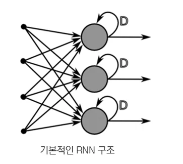

# Introduction to AI(인공지능개론)

- 한양대학교 이명규 교수의 강의에서 반복된 중요한 내용 및 교재에 없는 내용만 정리한 페이지입니다.
- 시험 공부는 이 페이지와 더불어 교수님의 강의용 깃허브에 있는 F&Q와 교재필기를 공부하세요.

---

# 교수님의 강의용 깃허브

https://github.com/MyungKyuYi/AI-class/tree/main

여기에 정말 좋은 자료들이 많다. 공부하면서 계속 보고 참고하고 참조하자.

---

**🗣️ 콜아웃은 교수님께서 여러 번 강조하셨던 내용을 담은 것이다.**

---

# 0. 인공지능이란 뭘까?

중요하지 않으므로 건너뛰어도 됨 → [건너뛰기](https://www.notion.so/Introduction-to-AI-330ac364b18880679cc2e8b19f46b777?pvs=21)

## 먼저, “지능”이 뭔지 알아야 한다. (인간의 지능) (중요 x)

먼저 지능(지적 능력)이란, 다음과 같다.

1. 지각: 눈, 코, 입, 촉각 등으로 외부 환경을 인식하는 능력
2. 기억: 정보를 저장했다가 꺼내 사용할 수 있는 능력
3. 학습: 정보를 기반으로 경험에서 지식을 습득하고 행동을 숙달하는 능력
4. 추론: 기존 지식과 규칙을 활용하여 새로운 결론을 도출하는 능력
5. 문제 해결: 주어진 목표를 달성하기 위해 전략(계획)을 세우고 실행하는 능력
6. 적응: 새로운 상황이나 환경 변화에 맞춰 지식을 재구성하고 행동을 조정하는 능력
7. 창의성: 기존의 지식과 아이디어를 결합해 새로운 아이디어나 해법을 만드는 능력
8. 사회성: 다른 존재와 상호작용하는 능력
- 인간에게는 추가로 언어 능력이라는 것이 있다.

모두 **생존**에 가까운 관계를 가진다. 생존에 유리한 사고와 행동을 하는 것이 결국에는 지능이다.

## 인공지능의 지능

그렇다면 인공지능의 지능은 뭘까? 인공지능도 정말 비슷하다.

1. 지각(인식): 입력을 받아들이는 것
2. 학습: 데이터를 기반으로 경험에서 지식을 습득하고 성능을 향상시키는 능력
3. 추론: 기존 지식과 규칙을 활용하여 새로운 결론을 도출하는 능력
4. 문제 해결: 주어진 목표를 달성하기 위해 전략(계획)을 세우고 실행하는 능력
5. 적응: 새로운 상황이나 환경 변화에 맞춰 지식을 재구성하고 행동을 조정하는 능력
6. 창의성: 기존의 지식과 아이디어를 결합해 새로운 아이디어나 해법을 만드는 능력
7. 사회성: 다른 존재와 상호작용하는 능력

---

**(이 뒤부터는 매우 중요!!)**

근데, 그냥 간단하게 이 수업에서의 지능을 최종적으로 정의하면,
**문제를 해결하기 위하여 데이터를 바탕으로 학습하고 이해하는 능력**이라고 보면 된다.

<aside>
🗣️

여기서 교수님은 결국에는 인공지능의 지능은 **분류(Classification)**과 **회귀(Regression)**이라고 한다. 분류랑 회귀는 교수님께서 엄청 강조하시고 매시간 말씀하시므로 엄청 중요하다. 애초에 인공지능의 거의 모든 활용 분야의 기저에 깔려 있기 때문이다.

근데, 교재에는 [**지도학습**](https://www.notion.so/Introduction-to-AI-330ac364b18880679cc2e8b19f46b777?pvs=21)의 큰 분류라고 본다. (챗지피티도.. 근데, 기저긴 하다고 인정함.)

---

- **분류(Classification)**: **이산적인 값**으로, 입력 데이터를 학습하여 2개 이상의 레이블로 **분할**하고 새로운 입력값이 어느 **레이블(또는 카테고리)에 속하는 지를 판별**한다.
    
    
    
    - 이메일이 **스팸 / 정상** 인지
    - 환자가 **암 있음 / 없음**인지
    - 사진이 **고양이 / 강아지 / 새**인지
    - 평가 지표: **Accurancy** (혼동행렬(Confusion Matrix)) (교재 pp. 133-136)
- **회귀(Regression)**: **연속적인 흐름**으로, 입력-출력 쌍을 학습한 후에 새로운 입력값의 **숫자나 크기, 양을 예측**한다.
    
    
    
    - 집값이 **얼마인지**
    - 내일 기온이 **몇 도인지**
    - 학생의 시험 점수가 **몇 점인지**
    - 평가 지표: **MSE(평균 제곱 오차)**

---

- 여기서, 교수님께서 강조하시는 것은 **Classification = Regression**이다!!!
- 왜? Classification을 여러 번 하면 결국에는 연속적이므로!!
    - 0-9를 2개로 0-4, 5-9로 나누는 것은 Classification.
    - 근데, 이 나누는 것을 여러 번 반복하면 결국 Regression
</aside>

---

## 용어 정리

AI, ML, DL의 포함 관계

- AI(인공지능): 인간처럼 학습하고 추론하는 프로그램 연구
- ML(머신러닝): 인공지능의 한 분야로서 프로그래밍 없이 스스로 학습하는 프로그램 연구
- DL(딥러닝): 인공신경망 등을 사용하여서 빅데이터로부터 학습하는 프로그램 연구

<aside>
🗣

여기서 ML과 DL의 차이는 뭘까??

- 머신러닝: 해당 데이터의 **도메인의 전문가(experts)**가 직접 **특징을 추출(Feature Extraction)**한 후에 학습이 가능. 즉, **사람**이 특징을 찾아서 모델에게 주어야 함.
    - **도메인 전문가에 따라 성능이 크게 좌우(의존적)**되며, **비용이 크다**는 한계가 有
- 딥러닝: **특징 추출과 학습을 동시에 진행**. 신경망이 직접 **자동**으로 특징을 추출하면서 학습. 즉, 특징을 스스로 추출
    - 도메인 지식에 대한 **전문성이 없어도** 되어 **비용이 적고**, 특정 사람(도메인 전문가)에 따라 **성능 편차가 없음.**
</aside>

---

# 1. 머신러닝과 전통적인 프로그램의 차이

- 전통적인 프로그램: 입력 데이터와 규칙(알고리즘 → 프로그램 코드로 변환)을 넣어서 출력 데이터를 생성한다.
- $\text{입력 데이터}+\text{사람이 만든 규칙(알고리즘)} = 출력$

- 머신러닝: 입력 데이터와 출력 데이터를 같이 넘겨주어서 컴퓨터가 규칙(알고리즘 → 프로그램 코드)를 생성한다.
- $\text{입력 데이터}+\text{정답 데이터(Label)} = \text{학습 알고리즘이 모델을 학습}$
- 그 이후
- $\text{새 입력}+\text{학습된 모델} = 출력$

<aside>
🗣

여기서 교수님께서는 컴퓨터는 그저 자원이고 **API**가 한다고 하심. (”AI는 API가 다한다.”)

- scikit-learn API
- TensorFlow API
- PyTorch API

그래서, 교수님의 설명에 따르면, 저 그림의 **컴퓨터** 대신 **API**가 들어감. (하지만, 교재에는 컴퓨터)

---

#### ML의 목표

결국 저 모델로 **우리가 하고자 하는 목표**는 뭘까?? **Classification**과 **Regression**을 하면서 우리가 얻고자 하는 **목표**는 뭘까?

바로 **데이터를 예측**하는 것이다. 즉, **데이터의 추세**를 파악하는 것이 우리의 목적이다.

그 말은 즉, 위의 저 그림의 **빨간 선** 처럼 $y=wx+b$에서 $w$인 **weight(가중치;기울기)**와 $b$인 **bias(편향)**을 구하는 것이다.

- 가중치($w$): 입력값(또는 입력 신호) $x$가 결과(또는 출력) $\hat{y}$에 미치는 중요도를 조절하는 역할
    
    → **입력값 $x$가 예측값(결과) $\hat{y}$에 미치는 중요도를 조절한다.**
    
    - 예시: 당뇨 예측기
        - 혈당 수치는 중요 → $w_{혈당}$가 높음.
        - 키는 중요하지 않음 → $w_{키}$가 낮음.
- 편향($bias$): **뉴런이 얼마나 쉽게 활성화되느냐**를 결정하는 변수
    
    편향은 **기본적으로 있는 성향**을 뜻하며, **출발선이 다른 것**을 의미한다.
    
    - 예시: 달리기 실력→남/여의 생물학적 특징이 다르므로 기록으로만 측정하면 여자가 불리함. 그래서 출발선을 다르게 둔다.
        - 남자는 달리기 여자보다 빠름 → bias를 낮춰서 뉴런이 덜 활성화 되도록
        - 여자는 달리기가 남자보다 느림 → bias를 높여서 더 활성화 되도록

---

→ 즉, 인공지능은 결국 **API**를 이용해서 데이터들을 입력해서 **데이터들의 가중치와 편향, 즉 데이터의 추세를 파악**하여 **데이터를 예측**하는 것이다.

</aside>

---

# 2. 머신러닝의 학습 종류

## 지도학습(Supervised Learning)

- 간단하게 말하면, **문제와 답이 정해진 것**이다. (**샘플과 레이블**을 제공받는 것)
- 입력값 $X$와 그에 대한 정답 $y$를 함께 주고, 새로운 입력이 들어왔을 때 정답을 잘 예측하도록 모델을 학습시키는  방법이다.
- 특징:
    - 입력 데이터와 정답 데이터가 함께 필요함
    - 예측 문제에 많이 사용됨
    - 사람이 정답을 미리 알려주는 방식
- 대표 작업:
    - **분류(Classification)**: 이메일이 스팸인지 아닌지 분류
    - **회귀(Regression)**: 집값, 온도, 매출 예측

## 비지도학습(Unsupervised Learning)

- 간단하게 말하면, **문제만 있고 답이 없는 것**이다. (**샘플만 받고 레이블은 주어지지 않는 것**)
- 학습 모델이 스스로 데이터 안의 숨겨진 **구조, 패턴, 관계**를 찾는다.
- 특징
    - 정답이 없음
    - 데이터의 구조를 파악하는 데 사용
    - 탐색적 분석에 자주 쓰임
- 대표 작업
    - **군집화(Clustering)**: 비슷한 데이터끼리 묶기
    - **차원 축소(Dimensionality Reduction)**: 중요한 정보만 남기고 데이터 압축
    - **연관 규칙 분석**: 함께 자주 나타나는 항목 찾기

## 반지도학습(Semi-Supervised Learning)

- 간단하게 말하면, $\text{반지도 학습} = \text{지도 학습} + \text{비지도 학습}$이다.
- **일부 데이터에만 정답이 있고, 나머지는 정답이 없는 경우** 사용하는 학습 방법이다.
- 현실에서는 데이터를 많이 **모으는 것은 쉽지만**, 그 데이터에 **일일이 라벨링을 하는 것은 시간과 비용이 많이 든다**. 그래서 반지도학습이 있는 것!!
- 특징:
    - 라벨이 있는 데이터는 적고, 없는 데이터는 많을 때 유용
    - 실제 현실에서 많이 사용됨
    - 라벨링 비용을 줄일 수 있음

## 강화학습(Reinforcement Learning)

- 간단하게 말하면, **강아지를 훈련하듯이 보상과 처벌**을 토대로 학습하는 것이다.
- 에이전트(agent, 모델과 의사결정 로직)가 환경(environment)과 상호작용하면서, 어떤 행동(action)을 했을 때 **보상(reward)**을 많이 받도록 학습하는 방법이다.

<aside>
💡

강화학습 예시: 알파고

- Agent: 알파고
- Environment: 바둑판+규칙+상대의 수 등등. 즉 바둑 게임의 상황 그 자체
- Action: 바둑판의 어느 위치에 돌을 놓을지 선택하는 것
- State: 현재 시점의 바둑판 상황
- Reward: 이기면 큰 보상, 지면 작거나 음수 보상(= 처벌)
</aside>

---

# 3. 머신러닝의 과정

## 순서

1. 학습 데이터 모으기
2. 학습 데이터 정제하기
3. 모델 학습하기
4. 평가
5. 예측

여기서, 1·2번의 과정은 **우리가 할 수 없다**.(이 영역은 **해당 도메인의 전문가의 영역**임.)
여기서 우리가 주목해야 하는 것은 3번의 모델 학습 전에 하는 **학습 데이터들**(1·2번을 통해 얻은 데이터)**을 Train_Data, Test_Data로 나누는 것**이다.

## Train Data, Test Data (훈련 데이터, 테스트 데이터)

우리는 받은 데이터를 저렇게 훈련 데이터, 테스트 데이터로 나눈다.

- 왜 train, test로 데이터를 나눌까?
    - **Seen Data(Train Data)**를 통해  **학습**을 하고(데이터 추세를 파악하고), U**nseen Data(Test Data)**로 학습한 모델을 **검사**하기 위해서이다. 이를 세련된 말로 **모델의 일반화**라고 한다.
    - 그리고, 모델의 일반화를 높인다는 말은 Seen Data를 가지고 학습해서 Unseen Data에 대한 학습력, 예측력을 높인다는 의미이다.

하지만, 여기서 문제는 Seen Data와 Unseen Data의 데이터 추세가 다르다는 것이다. (조금 차이나면 상관 없지만, 많이 차이가 나면, 학습과 검사에 문제가 생긴다. (당연한 얘기지. Seen Data는 불교 사람이 많고, Unseen Data는 기독교 사람이 많다면, 모델은 불교를 기준으로 학습을 했으니 문제, 검사는 기독교 사람을 기준으로 하니 문제가 되므로!)

---

## 학습

좌: Regression / 우: Classification

Train Data(Seen Data)를 통해 위의 그림처럼 [데이터 추세(모델)](https://www.notion.so/Introduction-to-AI-330ac364b18880679cc2e8b19f46b777?pvs=21)을 만든다. ($y=wx+b$)

이때, $x$는 데이터들의 특징(Feature)이다.

<aside>
🗣

여기서 주목해야 할 점은 학습 데이터의 Feature가 다양할 수록 좋다는 것이다. 당연한 얘기다.

예를 들어 당뇨인지 아닌지를 예측하는 모델을 만든다고 해보자. 오직, 혈당, 혈압만의 2가지 Feature만 있는 것보다, 나이, 성별, 혈당, 피하지방, 혈압 등 Feature가 많다면 더 질 좋은 모델을 구할 수 있다는 것은 너무나 당연하다.

**→ 즉, Feature가 많을 수록 예측 정확도가 ↑, 모델의 일반화가 높다.**

하지만, **비슷한 Feature**(다중공선성)나 **전혀 상관없는 Feature**는 오히려 더 **안 좋다**!!!

그래서, **Feature Selection(특징 선별)**이 매우 중요하다.

</aside>

---

# ML(머신러닝) (교재에 없는 내용. 필수 출제됨.)

## Classification 방법

### Decision Tree

출처: 텐서 플로우 블로그

- Decision Tree는 마치 **스무고개**와 비슷하다!! *(마치 Akinator같다.)*
- 스무고개가 **구체적인 질문을 통해 범위를 좁혀나가는 것**과 같은 원리다.
- 중요한 것은 **지니 계수**라는 것이 있다는 거다!! 지니 계수가 뭘까??

#### 지니 계수 (Gini Index)

- 지니 계수는 **불순도(Impurity)**와 관련이 있다.
- 불순도는 또 뭘까? 반의어인 **순도**를 통해 보면 이해하기 쉽다.
    - 순도는 말 그대로 **“얼마나 순수하냐?”** 이다.
        
        금으로 예시를 들어보면, 24K, 14K와 같이 “금이 순수하게 얼마나 들어있냐?” 와 같은 의미이다.
        
    
    → 그렇다는 건 **불순도는 얼마나 덜 순수하냐?**를 나타내는 지표이다.
    
    - 24K면 불순도가 낮은 거고, 14K이면 24K에 비해 불순도가 높은 것이다.
- 즉, **분류**할 때는 **불순도가 높은 것에서 낮아지는 방향으로 학습한다.**
- **그게 지니 계수이다. 지니계수가 낮아지도록 하는 것이 분류의 목적이다.**
- 이 지니계수를 정해주는 것은 결국 API가 한다.(교수님 왈)
- 그래서, 지니계수는 0과 1사이의 값을 가지는데, 지니계수가 높을 수록 잘 분류되지 못한 것이다.

---

다시 본론으로 돌아와서 우리가 한 Wine 데이터를 가지고 DT한 것을 보자.

 (Chrome의 백엔드 연구소)](image%2011.png)

출처: [https://velog.io/@gmlstjq123/Decision-Tree](https://velog.io/@gmlstjq123/Decision-Tree) (Chrome의 백엔드 연구소)

- 첫 루트 트리는 **“Sugar(당도)가 4.325 이하냐?”** 를 물어본다.
- 여기서 **True는 오른쪽 자식**으로, **False는 왼쪽 자식**으로 가서 이런 질문의 과정을 반복한다.
- 그렇게 하면서 지니계수를 낮추며 가는 것이다. (물론, 저 붉은 색 노드는 뭔가 데이터들이 섞인 것!)

<aside>
💡

**정리**

지니계수는 머신러닝의 Decision Tree에서 사용하는 불순도를 나타내는 기준이다. 그래서 DT는 이 지니계수가 최소화되는 분할을 찾는다.

</aside>

---

### Logistic Regression

- 얘는 Classification인 데 왜 이름은 Regression(회귀)일까?
    - 그 이유는 내부적으로 **연속적인 수치**(연속?→회귀!!)를 먼저 예측한 후, 이를 **로지스틱 함수(Logisitc Function)을 적용**해 0~1까지의 확률로 만든 후, 분류하기 때문에 분류 방법이지만 회귀라고 읽는다.
    - 로지스틱 함수는 다음과 같이 생겼다.
        
        
        
        출처: 위키백과
        
    - 정리: **연속적인 값 + Logistic 함수 적용 → 0~1의 확률값 → 분류**
        - 당뇨일 확률 0.82 → 1로 분류
        - 당뇨일 확률 0.17 → 0으로 분류

---

### Random Forest

- Random Forest를 알기 위해서는 먼저 **Bootstrapping**을 알아야 한다.

#### Bootstrapping

우리가 **특정 샘플**을 통해 머신러닝이나 통계를 뽑을 때, 학습이 잘되거나 통계 과정이 **맞아도 잘못되는 경우**가 있다. 그 이유는 **전체 데이터에 대한 특정 샘플의 데이터 분포가 달랐을 때**이다.

그러면, 이 문제를 어떻게 해야 할까? **단순히 데이터를 많이 뽑으면 되지만, 이건 비용이 많이 든다.**

결국에는 애초에 **특정 샘플의 데이터 분포를 균등하게 맞춰줘야 한다.**

그래서 Bootstrapping이란 데이터 분포를 균등하게 뽑기 위해 **중복을 허락하여 샘플링하는 것**을 의미한다.

---

다시 Random Forest로 돌아오면, 결국 우리가 현재 가지고 있는 데이터 샘플에 Bootstrapping을 해서(중복을 허용하여 샘플링) **여러 데이터 샘플들을 만들고 각각 데이터 샘플에다가 DT를 적용하는 것**이다.

**그 중에서 가장 성능이 좋은 DT를 뽑는 것이 Random Forest이다.** 그래서 이름도 무작위 숲인 이유가 현재 가지고 있는 샘플들을 무작위로 Bootstrapping하여 여러 샘플들을 만들고 모두 DT(나무!!)를 해서 하나를 뽑기 때문에 숲인거다. (많은 DT(나무)들이 있으니까..ㅎㅎ)

---

그다음으로 Random Forest에서 중요한 것은 **emsemble(앙상블)**이다.

#### Emsemble(앙상블)

앙상블이란, **분류기(모델)을 여러 개 사용하는 것**이다.

마치 주식 투자할 때, **위험을 최소화**하기 위해 분산 투자를 하는 것과 같다.

- 장점:
    - 성능이 좋다.
- 단점:
    - 비용이 많이 든다. (모델을 여러 개 사용하니까!!)

**→ 정리: 여러 DT를 보고 그 중에서 좋은 모델과 좋은 Bootstrapping된 샘플을 사용한 DT를 뽑는 것!!**

---

### SVM(Support Vector Machine)

아래 그림으로 보면 이해하기 쉽다.

출처: javapoint

과정은 다음과 같다.

1. 먼저 저렇게 초록색 데이터, 파란색 데이터로 나누어져 있을 때, **두 데이터 덩어리를 나누는 임의의 선을 하나 긋는다**.
2. **선과 가장 가까운 최전선 데이터(지원 벡터, Support Vectors)를 찾는다.**
3. **지원 벡터와 구분선과의 거리(Margin)을 구한다.**
4. **또 다른 임의의 선을 긋고 1-3번 과정을 반복한다.**
5. **각 선들 중 가장 Margin이 최대가 되는 선을 구한다.**

최전선 데이터와 구분선 사이의 거리(Margin)이 클수록 더 분류가 잘되기 때문에 Margin이 최대인 선을 구한다.

---

# Deep Learning

딥러닝에서 중요한 것은 오직 5개이다.

1. **Forward Propagation**
2. **Loss Function**
3. **Backward Propagation**
4. **Activation Function**
5. **Optimizer(경사하강법)**

## 1, 2, 3 설명

위 그림처럼 R, G, B가 있고, 밑에 여러 밸브가 있다고 해보자. (중간 노드(뉴런)들이 밸브라고 가정)

원하는 색을 뽑기 위해서는 저 모든 밸브들을 조금씩 조금씩 여러 번 조절해나가다 보면 원하는 색을 뽑을 수 있다. → 이와 같이 **처음부터 조금씩 조금씩 조절해 나가는 것을 Forward Propagation**이라고 한다.

그 이후에 **출력으로 나온 색깔과 실제 내가 원했던 색깔 사이의 오차를 구하는 것이 Loss Function**이다.

**Loss Function에 의해서 나온 손실을 통해 피드백으로 조절하는 것을 Backward Propagation**이라고 한다.

그렇게 해서, 모든 뉴런(노드)들 안에 있는 각각의 $w(가중치)$을 조절해서 최적값을 도출해 내는 것이 딥러닝이다.

### 정리

#### 1. Forward Propagation(순전파)

입력 데이터($x$)가 입력층에서 입력되어 은닉층들을 지나 출력층에서 예측값 $\hat{y}$를 계산하나가는 과정이다. 즉, 순방향(입력→은닉→출력)으로 진행되기 때문에, Forward인 것이다.

→ 입력 $x$를 신경망에 넣고, 각 층을 거치면서 **예측값** $\hat{y}$를 계산해 나가는 과정이다.

$$
x→은닉층들 →\hat{y}
$$

#### 2. Loss Function(손실 함수)

Forward Propagation에서 나온 **예측값 $\hat{y}$와 실제 정답 $y$가 얼마나 다른지** 수치로 나타내는 함수이다.

- 회귀: MSE
- 분류: Cross Entropy

#### 3. Backward Propagation(역전파)

손실 함수 값이 계산된 뒤, 그 오차가 각 가중치에 **얼마나 책임이 있는지**를 뒤에서부터 거꾸로 계산하는 과정

즉, 손실을 줄이기 위해 각 가중치를 **어느 방향으로 얼마나 바꿔야 하는지** 기울기(gradient)를 구하는 과정이다. 여기서 5번이 쓰인다. → [5번 설명 (Optimizer || 경사하강법(GDM))](https://www.notion.so/5-Optimizer-GDM-33dac364b18880ad805ac693e677c299?pvs=21) 

---

## 4번 설명

활성화 함수는 해당 뉴런을 활성화 시킬지 안 시킬지를 결정하기 때문에 활성화 함수라고 한다.

여기서 이 **Layer들이 많아지면 많아질 수록 딥러닝의 정확도(Accurancy)는 올라간다.**

하지만, 이러한 Layer를 무작정 늘리지는 않는다. 왜 그럴까? 그 이유는 마치 신서유기의 고요 속의 외침과 같다.

신서유기 2(tvN)

예능에서 보면, 처음 제시어를 받아 뒤로 전달할 때 점점 갈수록 뜻이 바뀌는 것을 볼 수 있다. 이것도 똑같은 원리다. **Layer가 많을 수록 Accurancy는 올라가지만, Layer를 많이 지나면 지날 수록 중간 중간에 손실이 일어나 본질이 흐려진다.**

또, **활성화 함수가 없으면, Layer를 여러개 쌓는 것은 아무런 쓸모가 없기 때문이다.** 왜 그럴까? 결국 Multi-Layer(다층 구조)의 **각 뉴런들은 $y=wx+b$인 선형 함수**이다. **이러한 선형 함수들은 여러 번 결합해도 결국은 선형 함수 하나와 같아 성능이 전혀 향상되지 않는다.**

그래서, 이를 막기 위해 **중간중간마다 비선형성을 부과(주입)하는 것이 필요한데, 그 역할을 Activation Function이 한다!!**

하지만, 이렇게 되면, Backward Propagation이 힘들어진다. 비선형성의 주입으로 어떻게 조절할지 정하기가 더 어려워지기 때문이다.

**→ 정리: Activation Function은 Layer를 많이 쌓을 수록 좋지만, 많이 쌓아도 선형성만 부과되기 때문에(뉴런이 $y=wx+b$이고, 선형을 여러번 결합해도 결국은 선형 함수 하나와 같기 때문에) 특징 추출(성능 향상)에 제한이 있고, 이를 방지하기 위해 비선형성을 가진 활성화 함수를 부과해서 더 많은 특징을 뽑도록 한 것이다.**

---

## 5번 설명 (Optimizer || 경사하강법(GDM))

- 교수님 왈 Optimizer는 경사하강법의 구현 방법이다.

 가중치에 대한 손실함수가 위 그림과 같을 때 **현재 위치에서 손실이 최소가 되는 방향(기울기의 반대 방향)으로 가야 한다.** 다음 그림처럼 말이다.

이렇게 되도록 하는 것이 **경사하강법**이다. 즉, **각 뉴런에서 손실을 최소화하기 위한 다음 가중치를 계산(수정)하는 방법(알고리즘)**이다.

공식은 다음과 같다.

$$
w_{t+1}=w_{t}-n\times G
$$

- $w_{t+1}$ : 구해야 할 다음 가중치
- $w_{t}$ : 현재 가중치
- $n$ : 학습률 (한 번에 매개 변수를 변경하는 비율)
    - 학습률이 너무 작으면 여러 번 계산해야 함. (비효율적)
    - 학습률이 너무 크면 최소값을 지나쳐서 너무 멀리 갈 수 있음.
    - 그래서 손실이 클 때는 학습률을 크기, 손실이 작으면 학습률은 작게한다.
- $G$ : Gradient(Loss Function의 미분값)

예시를 들어보고 계산해보자.

$Loss(w) = (x-3)^{2}+10$이고, $n=0.2$이고, $w_{t}=10$이라고 가정해보자.

공식은 $w_{t+1}=w_{t}-n\times G$ 이므로

1. 먼저 $G$를 구해보자.
2. $Loss(w)$인 손실함수를 미분한다. → $Loss(w)'=2w-6$이므로 $w_{t}$에 10을 대입하면,
$G=14$이다.
3. 대입하자.
4. $w_{t+1}=10-0.2\times 14 = 10-2.8=7.2$이다.

여기서 한 번 더 하면,

1. $w_{t}$에 7.2를 대입하면 $G=8.4$이다.
2.  $w_{t+1}=7.2-0.2\times 8.4 = 10-2.8=5.52$이다.

---
